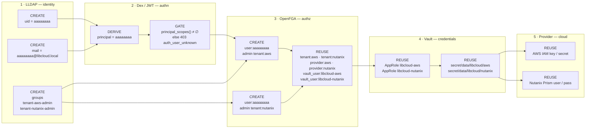

# Onboard a user: full workflow (LLDAP → OpenFGA → Vault → provider)

**Purpose.** Introduce a new user (`aaaaaaaa`) into the existing system and grant them
administration rights on the **AWS** and **Nutanix** providers. This runbook documents
every name created/assigned at each layer — LLDAP, OpenFGA, Vault, and the cloud
provider — and which names are *reused* rather than created.

> **Audience:** Cloud Admin (a superadmin-gated operator). **Reads:** `test_script/scripts/`,
> `openfga_postgres/openfga_bootstrap.py`, `openfga_postgres/vault_bootstrap.py`,
> `libcloud.rest/app/auth/identity.py`, `libcloud.rest/app/auth/policy.py`.

---

## 1. The trust chain

A user's identity is a single string that propagates through five systems. Each system
reads the name produced by the previous one and either *derives* a new name, *checks* it,
or *reuses* a pre-existing one. There is no per-user Vault identity and no per-user cloud
key — the user is *authorized to act through the tenant's shared credentials*.



---

## 2. Naming map (create vs. reuse)

This is the part to get exactly right. Only three things are *created*; everything else
already exists and must be left alone.

| Layer | Name | Action | Notes |
|---|---|---|---|
| LLDAP | `uid = aaaaaaaa` | **CREATE** | the canonical slug used everywhere below |
| LLDAP | `mail = aaaaaaaaaa@libcloud.local` | **CREATE** | Dex's `email` claim; local part = the slug |
| LLDAP | groups `tenant-aws-admin`, `tenant-nutanix-admin` | **CREATE** | must match the reconciler convention `tenant-<cloud>-<role>` |
| OpenFGA | `user:aaaaaaaa admin tenant:aws` | **CREATE** | grants AWS admin |
| OpenFGA | `user:aaaaaaaa admin tenant:nutanix` | **CREATE** | grants Nutanix admin |
| OpenFGA | `tenant:aws`, `tenant:nutanix`, `provider:*`, `libcloud_api:main`, `aws_region:aws`, `nutanix_cluster:nutanix`, `vault_user:libcloud-aws`, `vault_user:libcloud-nutanix` | REUSE | seeded by `openfga_bootstrap.py` |
| Vault | AppRole `libcloud-aws`, `libcloud-nutanix` + policies `libcloud-read-*` | REUSE | per-tenant, shared by all members |
| Vault | `secret/data/libcloud-vault-auth/libcloud-aws` (+ `-nutanix`) | REUSE | holds `{role_id, secret_id}` for the AppRole login |
| Vault | `secret/data/libcloud/aws`, `secret/data/libcloud/nutanix` | REUSE | the actual backend credentials |
| Provider | AWS IAM user (access key `AKIA…` + secret), Nutanix Prism account (username + password) | REUSE | the tenant's cloud accounts |

**`admin` vs `owner`.** `admin` gives `can_provision` + `can_update` on the tenant's
backend, but **not** `can_manage_credentials` or `can_assign_*` (those are owner-only).
If "administration rights" includes rotating the tenant's provider keys or managing
membership, use `owner` instead of `admin` in the two tuples below.

---

## 3. Steps

### Step 1 — create the LLDAP user

```bash
bash test_script/scripts/lldap-user-onboard.sh \
  --username aaaaaaaa \
  --display-name "AAAAAAAA Admin" \
  --email aaaaaaaa@libcloud.local \
  --password '<initial password>'
```

Creates `uid=aaaaaaaa,ou=people,dc=libcloud,dc=local` (GraphQL `createUser`) and sets the
password via an LDAP `userPassword` modify.

### Step 2 — grant the role (two equivalent paths)

**Path A — LLDAP groups + reconciler (declarative, preferred).** The reconciler
(`openfga-tuple-reconcile.py` / `openfga_pylib.py::group_to_tuple`) maps a group named
`tenant-<cloud>-<role>` to the tuple `user:<member> <role> tenant:<cloud>`.

```bash
bash test_script/scripts/lldap-group-create.sh     --name tenant-aws-admin
bash test_script/scripts/lldap-group-create.sh     --name tenant-nutanix-admin
bash test_script/scripts/lldap-group-add-member.sh --user aaaaaaaa --group tenant-aws-admin
bash test_script/scripts/lldap-group-add-member.sh --user aaaaaaaa --group tenant-nutanix-admin
```

Each `add-member` auto-runs the reconciler, writing the two tuples. Or run the whole chain
in one call:

```bash
# spec.json: {"username":"aaaaaaaa","display_name":"AAAAAAAA Admin",
#             "email":"aaaaaaaa@libcloud.local","groups":["tenant-aws-admin","tenant-nutanix-admin"]}
bash test_script/scripts/chain-onboard-user.sh --spec spec.json
```

> ⚠️ **Naming gotcha.** `lldap-group-create.sh` *recommends* `<scope>-<role>-<provider>`
> (e.g. `cloud-admin-aws`), but the reconciler only maps `tenant-<cloud>-<role>` (or
> `platform-superadmin`). A group named `cloud-admin-aws` is **ignored**. Also note the
> group name uses the **tenant id** (`nutanix`), not the user-slug prefix (`ntnx`).

**Path B — write the tuples directly** (superadmin-gated, as in `create_tenant.sh`):

```text
user:aaaaaaaa  admin  tenant:aws
user:aaaaaaaa  admin  tenant:nutanix
```

```bash
# via openfga-tuple-write.sh, or the portal's superadmin "tuples" screen
```

These two tuples are the *only* OpenFGA state needed. The model derives the rest:

- `can_connect libcloud_api:main` — via `tenant:* → parent → member`
- `can_use provider:aws` **and** `provider:nutanix` — via tenant membership
- `can_provision` / `can_update` on `aws_region:aws` and `nutanix_cluster:nutanix` —
  via the `(tenant_admin ∩ provider.can_use)` intersection

### Step 3 — satisfy the JWT scope/provider gate (easy to miss)

The REST API enforces **two independent gates**, and OpenFGA is only the second.
`libcloud.rest/app/auth/oidc_service.py` rejects any principal that resolves to an empty
scope set:

```python
scopes = principal_scopes(principal)
if not scopes:
    raise APIError("auth_user_unknown", "OIDC principal is not mapped to libcloud permissions", 403)
```

`principal_scopes()` / `principal_providers()` (`identity.py`) return non-empty only for
principals in `PRINCIPAL_SCOPES`/`PRINCIPAL_PROVIDERS` **or** carrying a `-owner`/`-admin`/
`-viewer` suffix. A bare `aaaaaaaa` has neither → **403 even though the tuples are correct.**

Pick one consistent fix:

- **Rename with a role suffix** (native): LLDAP uid `aaaaaaaa-admin` → auto
  `PROVISIONER_SCOPES` + `allowed_providers=["*"]`, OpenFGA `user:aaaaaaaa-admin`.
  (`principal_providers` returns `["*"]` for any role-suffix slug, so OpenFGA's
  `can_use(provider:<cloud>)` still enforces the per-cloud boundary.)
- **Add a `principal_map.json` entry** (`by_email`: `aaaaaaaa@libcloud.local` → a
  role-suffixed slug) **and** write the OpenFGA tuples against that same slug.
- **Add `aaaaaaaa` to `PRINCIPAL_SCOPES` / `PRINCIPAL_PROVIDERS`** in `identity.py`.

> The **one rule**: the LLDAP uid, the resolved JWT principal, and the OpenFGA
> `user:<slug>` must be the **same string** — and that string must earn non-empty scopes.
> Any mismatch breaks the chain before OpenFGA is consulted.

### Step 4 — Vault: nothing to create

The tenant AppRoles (`libcloud-aws`, `libcloud-nutanix`) already exist. At request time
`policy.py::_resolve_vault_user()` asks OpenFGA "what `vault_user` parents `tenant:aws`?"
→ `libcloud-aws`; then `vault_client.py`:

1. reads `secret/data/libcloud-vault-auth/libcloud-aws` (orchestrator token) → `{role_id, secret_id}`,
2. `POST /auth/approle/login` → a 60-minute token bound to `libcloud-read-aws`,
3. reads `secret/data/libcloud/aws` → the tenant's AWS key/secret.

Same for `tenant:nutanix` → `libcloud-nutanix` → `secret/data/libcloud/nutanix`.

Only create a Vault identity when onboarding a **new tenant** (`vault_tenant_role.py` /
`materialize_vault_users.py`) — not when onboarding a new user. Optional: to let the user
log into Vault **directly**, bind the group to a Vault policy with
`vault-ldap-group-bind.sh <group> <policy>`.

### Step 5 — provider: act through the tenant's account

- **AWS** — the user provisions through the tenant's IAM user stored at
  `secret/data/libcloud/aws` (`key`/`secret`, the `AKIA…`). No new IAM user is created.
- **Nutanix** — the user provisions through the tenant's Prism Central account at
  `secret/data/libcloud/nutanix` (`key`/`secret`).

The credential values themselves are written by `set_tenant_credentials.py`, gated on
OpenFGA `can_manage_credentials` (owner-only).

---

## 4. Verification

```bash
# tuples for this user
SUPERADMIN_JWT=… python3 test_script/scripts/dump_openfga_user_mapping.py
# or a single check
bash test_script/scripts/openfga-check.sh user:aaaaaaaa admin tenant:aws
bash test_script/scripts/openfga-check.sh user:aaaaaaaa admin tenant:nutanix

# Vault identities + secrets (names only)
python3 vault/list_users.py
python3 vault/list_credentials.py
```

---

## 5. Alternative — `aaaaaaaa` as a brand-new tenant (own keys)

If the user needs **their own** AWS/Nutanix credentials (not the shared `aws`/`nutanix`
tenants'), create a tenant instead:

```bash
TENANT=aaaaaaaa CLOUD=aws     bash test_script/scripts/create_tenant.sh
TENANT=aaaaaaaa CLOUD=aws     LIBCLOUD_USER=aaaaaaaa-owner LIBCLOUD_PASSWORD=… \
                              LIBCLOUD_AWS_KEY=AKIA… LIBCLOUD_AWS_SECRET=… \
                              python3 test_script/scripts/set_tenant_credentials.py
# repeat with CLOUD=nutanix and LIBCLOUD_NTNX_USER/LIBCLOUD_NTNX_PASSWORD
```

This mints new objects at every layer: `tenant:aaaaaaaa`, `aws_region:aaaaaaaa` /
`nutanix_cluster:aaaaaaaa`, `vault_user:libcloud-aaaaaaaa`, AppRole `libcloud-aaaaaaaa`,
and Vault paths `secret/data/libcloud/aaaaaaaa` — a heavier operation than user onboarding.

---

## Related files

- `test_script/scripts/chain-onboard-user.sh` — the atomic onboarding chain
- `test_script/scripts/lldap-user-onboard.sh`, `lldap-group-create.sh`, `lldap-group-add-member.sh`
- `test_script/scripts/openfga-tuple-reconcile.py`, `openfga_pylib.py` — group→tuple mapping
- `openfga_postgres/openfga_bootstrap.py` — seeded tuples + model validation
- `openfga_postgres/vault_bootstrap.py` — per-tenant AppRoles + orchestrator token
- `libcloud.rest/app/auth/identity.py`, `oidc_service.py`, `policy.py` — the scope/principal gate
- `test_script/scripts/dump_openfga_user_mapping.py`, `vault/list_users.py`, `vault/list_credentials.py` — verification
