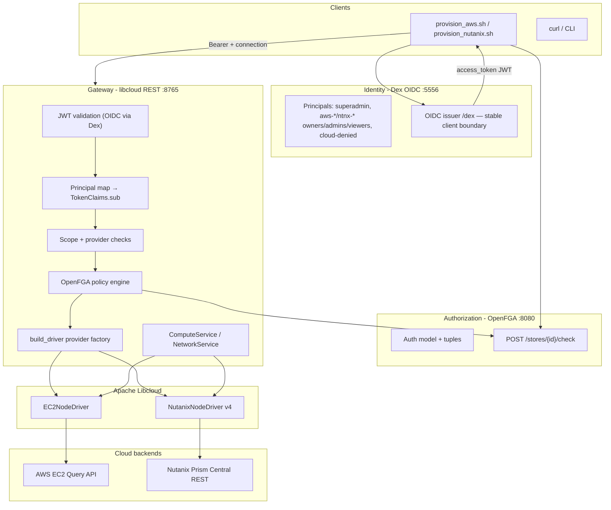
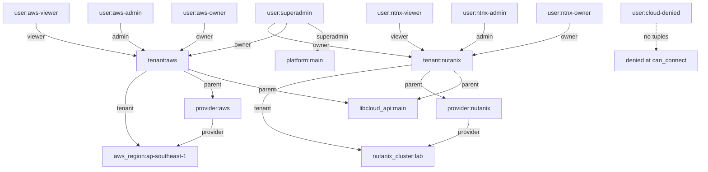
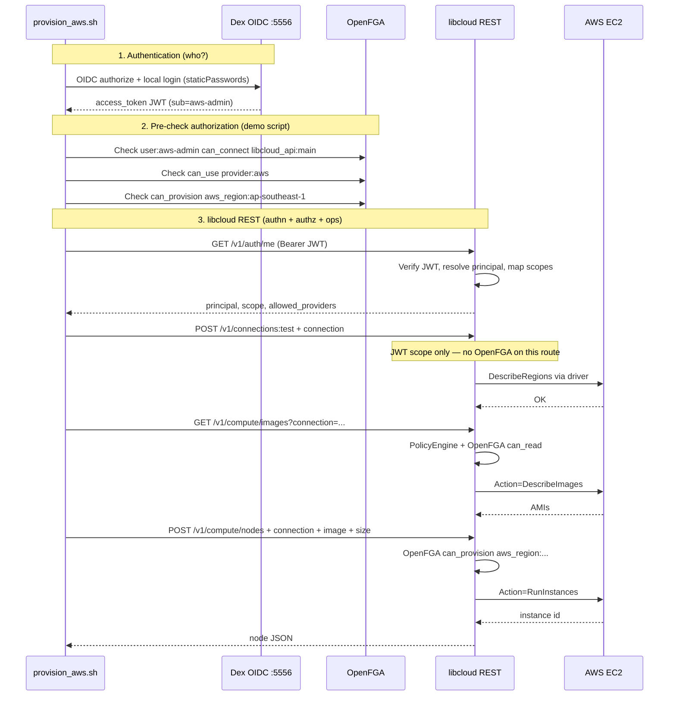

# System Architecture — libcloud REST + Dex OIDC + OpenFGA

This stack separates **identity**, **API authorization**, and **cloud operations** into distinct layers. Clients talk to one unified REST API; libcloud REST fans out to AWS EC2 or Nutanix Prism Central via Apache Libcloud drivers.

> **Identity:** Dex is the stable OIDC issuer; users live in **LLDAP** (`../lldap`) and Dex authenticates against LLDAP over an LDAP connector (Phase 2: swap LLDAP for upstream Entra/AD via Dex connectors). See [IDENTITY.md](IDENTITY.md) for principal mapping and migration strategy.



---

## 1. Components overview

| Component | Technology | Port | Persistent storage | Role |
|---|---|---|---|---|
| **Dex** | Docker (`ghcr.io/dexidp/dex`) | 5556 | In-memory (`storage.type: memory`) | **Stable OIDC issuer**; LDAP connector → LLDAP (Phase 2: upstream connectors) |
| **LLDAP** | Docker (`lldap/lldap`) | 17170 / 3890 | `lldap_data` volume | User directory for Dex (uid, mail, password, custom attrs) |
| **Dex bootstrap** | `dex_bootstrap.py` | — | Writes `generated/dex.env`, `dex/config.yaml` | Render config (LDAP connector + client secret), OIDC discovery verification |
| **OpenFGA** | Docker (`openfga-local`) | 8080 | In-memory in demo compose* | Fine-grained authorization (ReBAC) |
| **OpenFGA bootstrap** | `openfga_bootstrap.py` | — | Writes `generated/fga.env` | Store, model, tuples, validation checks |
| **Authentik** *(optional)* | Docker profile `authentik` | 9000 | PostgreSQL + Redis | Phase 2 upstream IdP example only |
| **libcloud REST** | FastAPI Docker | 8765 | Optional `data/users.json` (local auth fallback) | Unified cloud API gateway |
| **Provisioning scripts** | Bash + Python | — | Token cache in `generated/tokens/` | End-to-end demo flows |

See **[IDENTITY.md](IDENTITY.md)** for principal mapping (`superadmin`, `aws-owner`/`aws-admin`/`aws-viewer`, `ntnx-owner`/`ntnx-admin`/`ntnx-viewer`, `cloud-denied`) and Phase 2 migration.

\*Production OpenFGA would use PostgreSQL; the demo stack uses `--datastore-engine=memory` unless configured otherwise.

---

## 2. Responsibility split (authentication vs authorization)

| Question | Answered by | Mechanism |
|---|---|---|
| **Who is the caller?** | Dex (OIDC) → principal map | JWT `sub` mapped to stable principal (`superadmin`, `aws-admin`, …) |
| **May they call this API scope?** | libcloud REST | JWT `scope` + `allowed_providers` (from `identity.py` principal map) |
| **May they use AWS/Nutanix on this backend?** | OpenFGA | `can_connect`, `can_use`, `can_provision` / `can_read` checks |
| **How do we reach AWS/Nutanix?** | libcloud REST + Libcloud | Client-supplied `connection` object with cloud credentials |

---

## 3. libcloud REST API design

### 3.1 Architectural pattern

libcloud REST is **not** a transparent HTTP reverse proxy to AWS or Nutanix URLs. It is a **provider-neutral REST facade**:

```
Client HTTP request
  → FastAPI route (e.g. POST /v1/compute/nodes)
  → PolicyEngine (scopes + OpenFGA)
  → ComputeService method
  → libcloud NodeDriver method
  → Provider-native API call(s)
```

Design principles:

| Principle | Implementation |
|---|---|
| **Stateless gateway** | Cloud credentials travel in every request via `connection`; not stored server-side |
| **Provider routing** | `connection.provider` → `build_driver()` → AWS or Nutanix driver |
| **Uniform resource model** | Same paths (`/v1/compute/nodes`, `/images`, …) for both providers |
| **Scope-gated operations** | Each route requires OAuth-like scopes (`compute:node:create`, etc.) |
| **Optional async** | Long ops can return `job_id` via `execution.mode: async` |
| **Standard envelope** | All responses: `{ "data": ..., "meta": { "request_id": ... } }` |

### 3.2 API surface (prefixes)

| Prefix | Purpose |
|---|---|
| `/health` | Liveness (no auth) |
| `/v1/auth/*` | Local login, refresh, logout, `/me`, introspect |
| `/v1/providers` | Capability discovery per provider |
| `/v1/connections:test` | Test `connection` + return driver capabilities |
| `/v1/compute/*` | Nodes, images, sizes, locations, volumes, snapshots, key-pairs |
| `/v1/compute/networks`, `/subnets`, `/security-groups`, … | Network resources (shared prefix) |
| `/v1/jobs/{id}` | Async job status |

### 3.3 The `connection` object (routing key)

Every compute/network call includes a **connection** that selects the backend:

```json
{
  "provider": "aws",
  "config": { "region": "ap-southeast-1", "secure": true },
  "credentials": { "key": "AKIA...", "secret": "..." }
}
```

```json
{
  "provider": "nutanix",
  "config": {
    "host": "prism.example.com",
    "port": 9440,
    "secure": true,
    "api_version": "v4.0",
    "verify_ssl_cert": false
  },
  "credentials": { "key": "admin", "secret": "..." }
}
```

| Transport | How `connection` is passed |
|---|---|
| `GET` / `DELETE` | Query param: `?connection=<url-encoded-json>` |
| `POST` / `PATCH` | JSON body field: `"connection": { ... }` |

Driver selection (`app/providers/factory.py`):

| `connection.provider` | Libcloud driver | Backend target |
|---|---|---|
| `"aws"` | `libcloud.compute.providers.EC2` | `https://ec2.{region}.amazonaws.com/` |
| `"nutanix"` | `NutanixNodeDriver` | `https://{host}:{port}/api/...` |

---

## 4. REST URL mapping: libcloud REST → Libcloud → cloud APIs

Mapping happens in **three hops**, not one direct URL rewrite.

### 4.1 Layer 1 — libcloud REST endpoint → service → driver method

Representative mappings (full table in `../libcloud.rest/REST_API_REFERENCE.md`):

| libcloud REST | Required scope | AWS driver | Nutanix driver |
|---|---|---|---|
| `GET /v1/compute/locations` | `compute:location:read` | `list_locations()` | `ex_list_clusters()` |
| `GET /v1/compute/images` | `compute:image:read` | `list_images(ex_filters=…)` | `list_images()` |
| `GET /v1/compute/sizes` | `compute:size:read` | `list_sizes()` | `list_sizes()` |
| `GET /v1/compute/nodes` | `compute:read` | `list_nodes()` | `list_nodes()` |
| `POST /v1/compute/nodes` | `compute:node:create` | `create_node(...)` | `create_node(...)` |
| `DELETE /v1/compute/nodes/{id}` | `compute:node:delete` | `destroy_node()` | `destroy_node()` |
| `GET /v1/compute/subnets` | `compute:network:read` | `ex_list_subnets()` | `ex_list_subnets()` |
| `GET /v1/compute/networks` | `compute:network:read` | `ex_list_networks()` | `ex_list_vpcs()` |
| `POST /v1/connections:test` | (varies) | `list_locations()` + probe | same |

AWS CLI equivalence (documented in `../libcloud.rest/aws_cli_mapping_2_json.md`):

| AWS CLI / EC2 action | libcloud REST |
|---|---|
| `DescribeImages` | `GET /v1/compute/images?owner=…&name=…` |
| `DescribeInstances` | `GET /v1/compute/nodes` |
| `RunInstances` | `POST /v1/compute/nodes` |
| `TerminateInstances` | `DELETE /v1/compute/nodes/{id}` |
| `DescribeSubnets` | `GET /v1/compute/subnets` |
| `DescribeVpcs` | `GET /v1/compute/networks` |

### 4.2 Layer 2 — libcloud driver → AWS EC2 (Query API)

AWS does **not** use resource-style REST paths like `/v1/instances`. Libcloud EC2 uses the **EC2 Query protocol**:

| libcloud method | HTTP to AWS | EC2 `Action` parameter |
|---|---|---|
| `list_images()` | `POST https://ec2.{region}.amazonaws.com/` | `DescribeImages` |
| `list_nodes()` | `POST` same endpoint | `DescribeInstances` |
| `create_node()` | `POST` same endpoint | `RunInstances` |
| `destroy_node()` | `POST` same endpoint | `TerminateInstances` |
| `list_sizes()` | (local catalog + optional pricing API) | `DescribeInstanceTypes` / constants |
| `ex_list_subnets()` | `POST` same endpoint | `DescribeSubnets` |

Example body shape for `DescribeImages` (conceptually):

```
Action=DescribeImages
&Version=2016-11-15
&Filter.1.Name=name
&Filter.1.Value.1=*Ubuntu*
&Owners.1=amazon
```

libcloud REST adds filters (e.g. default `name=*Ubuntu*` for AWS) before calling `driver.list_images(ex_filters={"name": "…"})`.

### 4.3 Layer 2 — libcloud driver → Nutanix v4 REST

Nutanix uses **real HTTPS REST paths** under Prism Central:

| libcloud method | Nutanix HTTP path (pattern) |
|---|---|
| `list_nodes()` | `GET /api/vmm/v4.0/ahv/config/vms` |
| `create_node()` | `POST /api/vmm/v4.0/ahv/config/vms` |
| `destroy_node()` | `DELETE /api/vmm/v4.0/ahv/config/vms/{vmExtId}` |
| `list_images()` | `GET /api/vmm/v4.0/content/images` |
| `ex_list_clusters()` | `GET /api/clustermgmt/v4.0/...` (clusters) |
| `ex_list_subnets()` | `GET /api/networking/v4.0/...` |
| `ex_list_vpcs()` | `GET /api/networking/v4.0/...` |

Path construction: `/api/{namespace}/{api_version}/{resource}` via helpers like `vmm_path()`, `networking_path()` in `libcloud/common/nutanix.py`.

Mutating Nutanix calls often return a **task ID**; the driver polls task completion before returning the VM entity.

### 4.4 What is *not* 1:1 at the URL level

| Aspect | Behavior |
|---|---|
| **Single libcloud URL → single cloud URL** | Not guaranteed; one libcloud call may trigger multiple backend calls |
| **AWS** | All actions hit one regional endpoint with different `Action=` values |
| **Nutanix** | Paths differ by namespace (`vmm`, `networking`, `clustermgmt`, …) |
| **Unsupported ops** | Return `provider_capability_unsupported` (e.g. AWS security-groups via Nutanix-only paths) |

Provider-specific extras pass through allowlisted `provider_options` / `ex_*` fields (see `AWS_ALLOWED_EX` / `NUTANIX_ALLOWED_EX` in `../libcloud.rest/app/compute/service.py`).

---

## 5. Identity & principals (Dex OIDC)

Dex is the **stable OIDC issuer** for all clients. OpenFGA and libcloud REST never depend on Dex-local-only identifiers directly — they use **application principal slugs** resolved from token claims.

### 5.1 Users (managed in LLDAP, authenticated by Dex via LDAP)

Dex no longer stores users (`staticPasswords`/`enablePasswordDB` removed). Users live in **LLDAP** (`../lldap`, web UI `http://localhost:17170`); Dex authenticates against LLDAP over an LDAP connector (`idAttr: uid`, `emailAttr: mail`).

| LLDAP `uid` | Email | OIDC `sub` | OpenFGA subject | Effective access |
|---|---|---|---|---|
| `superadmin` | `superadmin@libcloud.local` | `superadmin` | `user:superadmin` | Platform superadmin (bootstrap); gates Vault/OpenFGA/LLDAP admin |
| `aws-owner` | `aws-owner@libcloud.local` | `aws-owner` | `user:aws-owner` | owner of `tenant:aws` (provision + assign admin/viewer) |
| `aws-admin` | `aws-admin@libcloud.local` | `aws-admin` | `user:aws-admin` | admin of `tenant:aws` (provision AWS) |
| `aws-viewer` | `aws-viewer@libcloud.local` | `aws-viewer` | `user:aws-viewer` | viewer of `tenant:aws` (enumerate only) |
| `ntnx-owner` | `ntnx-owner@libcloud.local` | `ntnx-owner` | `user:ntnx-owner` | owner of `tenant:nutanix` |
| `ntnx-admin` | `ntnx-admin@libcloud.local` | `ntnx-admin` | `user:ntnx-admin` | admin of `tenant:nutanix` (provision Nutanix) |
| `ntnx-viewer` | `ntnx-viewer@libcloud.local` | `ntnx-viewer` | `user:ntnx-viewer` | viewer of `tenant:nutanix` (enumerate only) |
| `cloud-denied` | `cloud-denied@libcloud.local` | `cloud-denied` | *(no tuples)* | Authenticated; denied by OpenFGA |

Per-cloud passwords are generated by `setup.sh` into `generated/dex.env`. Manage users in LLDAP, not in Dex. The `superadmin` identity gates Vault seeding, OpenFGA policy/privilege changes, and LLDAP user CRUD (`scripts/superadmin_auth.sh`).

### 5.2 Dex JWT payload (typical)

| Claim | Content |
|---|---|
| `sub` | Stable principal slug in Phase 1 (`cloud-admin`); opaque GUID in Phase 2 (mapped via `principal_map.json`) |
| `email` | Secondary mapping key (`cloud-admin@libcloud.local`) |
| `iss` | `http://localhost:5556/dex/` |
| `aud` | `libcloud-rest` |

**No libcloud API scopes or OpenFGA relations are embedded in the Dex JWT.** libcloud REST derives scopes from the resolved principal (`app/auth/identity.py`).

### 5.3 Principal resolution flow

```
Dex access_token
  → verify signature (JWKS at /dex/keys)
  → resolve_principal(sub, email)  [data/principal_map.json]
  → TokenClaims.sub = superadmin | aws-admin | aws-viewer | ntnx-admin | ntnx-viewer | cloud-denied
  → OpenFGA checks user:{TokenClaims.sub}
```

Legacy script aliases are supported in `principal_map.json` and `scripts/common.sh` (e.g. `*-viewer` users take the read-only path).

See **[IDENTITY.md](IDENTITY.md)** for Phase 2 Entra/AD migration and audit logging.

### 5.4 Optional: external upstream IdP (Phase 2)

The bundled Authentik/PostgreSQL/Redis services were removed from `docker-compose.yml`. Dex is the OIDC issuer and authenticates users against **LLDAP** (`../lldap`) over an LDAP connector. To use another external upstream IdP (Entra ID, AD, Authentik, etc.) instead of LLDAP, run it in its own project and reconfigure the Dex connector in `dex/config.template.yaml`. Clients still talk to Dex only.

### 5.5 Backend credential storage (Vault)

Cloud login credentials (AWS / Nutanix) are stored as encrypted KV v2 secrets in Vault under `secret/libcloud/<binding>` — per-tenant: `secret/libcloud/aws` and `secret/libcloud/nutanix`. `vault_bootstrap.py` initializes/unseals Vault, enables KV v2, and issues a least-privilege read token; it does **not** seed credentials. The libcloud REST API reads them at runtime (`VAULT_ADDR` / `VAULT_TOKEN`) instead of holding plaintext keys; clients never receive backend credentials. Vault state lives on the `vault-data` volume and survives reboot/restart.

**superadmin gating:** `vault_bootstrap.py` refuses to initialize/configure Vault unless `SUPERADMIN_JWT` is present — i.e. someone has successfully logged in to Dex as the LLDAP `superadmin` user. `setup.sh` performs the superadmin login first via `scripts/superadmin_auth.sh` and passes the JWT through the compose environment.

**Per-tenant credentials (owner-only, multi-tenant):** backend cloud credentials are not global. Each tenant maps to its own Vault path (`secret/data/libcloud/<tenant>`) and its own OpenFGA backend object (`aws_region:<tenant>` / `nutanix_cluster:<tenant>`), so different AWS/Nutanix tenants use different access keys. They are written by the tenant **owner** only via `scripts/set_tenant_credentials.py`, which gates the write on the OpenFGA `can_manage_credentials` relation (owner-only; superadmin is owner on all tenants as break-glass). New tenants are minted by `scripts/create_tenant.sh` (superadmin-gated). The `auth_binding` selector sent by client scripts picks the per-tenant backend object + Vault secret at runtime. Credentials never live in `.env`. (Full per-tenant enforcement in libcloud REST requires `policy.py` to derive the backend object from `auth_binding` — see authorization.md §3.)

---

## 6. Authorization model (OpenFGA)

### 6.1 Object graph (simplified)



### 6.2 Relations checked at runtime

| OpenFGA relation | Object | Meaning |
|---|---|---|
| `can_connect` | `libcloud_api:main` | May use libcloud REST at all |
| `can_use` | `provider:aws` / `provider:nutanix` | May target that provider |
| `can_provision` | `aws_region:…` / `nutanix_cluster:…` | May create/modify resources |
| `can_read` | same backend objects | Read-only access |

### 6.3 Principals vs permissions

| Principal | `can_connect` | `can_use` AWS / NTNX | `can_provision` | `can_read` |
|---|---|---|---|---|
| `superadmin` | ✓ | ✓ / ✓ | ✓ | ✓ |
| `aws-owner` / `aws-admin` | ✓ | ✓ / ✗ | ✓ (AWS) | ✓ (AWS) |
| `aws-viewer` | ✓ | ✓ / ✗ | ✗ | ✓ (AWS) |
| `ntnx-owner` / `ntnx-admin` | ✓ | ✗ / ✓ | ✓ (NTNX) | ✓ (NTNX) |
| `ntnx-viewer` | ✓ | ✗ / ✓ | ✗ | ✓ (NTNX) |
| `cloud-denied` | ✗ | ✗ / ✗ | ✗ | ✗ |

Per-cloud isolation is enforced via tenant membership: AWS tenant members are not members of `tenant:nutanix`.

Stored in the **OpenFGA tuple store** (17 seeded tuples). Defined by `openfga_bootstrap.py` (25 post-deploy validation checks). OpenFGA policy/privilege writes are gated on a `superadmin` Dex login (`SUPERADMIN_JWT`).

---

## 7. libcloud REST coarse authorization (scopes)

Separate from OpenFGA, libcloud enforces **API scopes** on each route.

### 7.1 Scope assignment (OIDC mode)

When a Dex OIDC token arrives, `oidc_service.py` resolves the principal, then `identity.py` assigns scopes:

| Principal | Scopes | `allowed_providers` |
|---|---|---|
| `cloud-admin` | Provisioner scopes (create/read compute, network, jobs, …) | `["*"]` via admin-equivalent mapping |
| `cloud-readonly` | Read-only compute + network | `["aws", "nutanix"]` |
| `cloud-denied` | Reader scopes in JWT* | `["aws", "nutanix"]` |

\*`cloud-denied` receives read scopes so callers can reach libcloud REST far enough for **OpenFGA** to deny (`can_connect` fails). This demonstrates authz separation from authentication.

Configuration: `../libcloud.rest/app/auth/identity.py` (`PRINCIPAL_SCOPES`) + `data/principal_map.json`.

### 7.2 Local JWT mode (alternative path)

`POST /v1/auth/login` embeds scopes **inside the JWT**:

```json
{
  "sub": "admin",
  "scope": "compute:read compute:node:create ...",
  "allowed_providers": ["*"],
  "tenant_id": "default",
  "jti": "...",
  "exp": ...
}
```

User records live in `data/users.json` (persistent volume).

---

## 8. End-to-end authentication & authorization flow

Using `PROVISION=1 LIBCLOUD_USER=aws-admin ./scripts/provision_aws.sh` as the reference path:



### 8.1 Step-by-step: authentication → authorization mapping

| Step | Layer | Input | Output / decision |
|---|---|---|---|
| 1 | **Dex** | Username + password (`staticPasswords`) | JWT with `sub` (principal slug in Phase 1) |
| 2 | **libcloud REST** | Bearer JWT | Validate via Dex JWKS; extract claims |
| 3 | **Principal map** | `sub`, `email` | `TokenClaims.sub` = `aws-admin`, scopes, `allowed_providers` |
| 4 | **Route guard** | Required scope on endpoint | 403 if scope missing |
| 5 | **Provider guard** | `connection.provider` | 403 if not in `allowed_providers` |
| 6 | **OpenFGA** (if `FGA_ENABLED=true`) | `user:{principal}`, relation, object | 403 if denied |
| 7 | **Libcloud driver** | `connection.credentials` | Calls AWS/Nutanix with **cloud** credentials |

**Critical point:** The JWT proves identity to libcloud REST. OpenFGA decides **policy**. The `connection` object supplies **cloud account credentials** for the actual provisioning — three different credential/permission layers.

### 8.2 PolicyEngine logic (`app/auth/policy.py`)

For each mutating/read call with a `connection`:

1. **Scope check** — token must include required scope (e.g. `compute:node:create`)
2. **Provider check** — `connection.provider` must be allowed for user
3. **OpenFGA check** (when enabled):
   - Always: `can_connect` on `libcloud_api:main`
   - Always: `can_use` on `provider:{aws|nutanix}`
   - Writes: `can_provision` on `aws_region:{region}` or `nutanix_cluster:{cluster}`
   - Reads: `can_read` on same backend object (or `can_provision` fallback)

---

## 9. Configuration & persistence summary

| Data | Location | Survives reboot? | Who maintains it? |
|---|---|---|---|
| Dex static users (Phase 1) | `dex/config.yaml` | Yes (file) | `dex_bootstrap.py` / ops (temporary) |
| Principal mapping | `data/principal_map.json` | Yes (file) | Ops / IdP migration |
| OpenFGA tuples + model | FGA datastore | Yes (if DB-backed) | `openfga_bootstrap.py` |
| OIDC client secret, issuer | `generated/dex.env` | Yes (file) | `dex_bootstrap.py` |
| FGA store/model IDs | `generated/fga.env` | Yes (file) | `openfga_bootstrap.py` |
| Principal→scope map | `identity.py` + `principal_map.json` | Yes (in image/file) | Developers / ops |
| Auth audit log | `data/auth_audit.log` | Yes (volume) | libcloud REST on each OIDC decode |
| Local auth users (fallback) | `data/users.json` | Yes (volume) | API / file edit |
| Cloud credentials | Client request only | Never stored | Client env / scripts |
| Cached OIDC refresh tokens | `generated/tokens/*.json` | Yes (file) | `idp_login.py` |
| Authentik (optional profile) | PostgreSQL volume | Yes | `authentik_bootstrap.py` / UI |

---

## 10. Design trade-offs (conceptual)

| Choice | Benefit | Cost |
|---|---|---|
| **Unified `/v1/compute/*` API** | One client contract for AWS + Nutanix | Not a native AWS/Nutanix API passthrough |
| **Client-supplied `connection`** | No cloud creds in server DB | Credentials in every request; client must protect them |
| **Dex as OIDC boundary** | Stable client config; swap upstream IdP in Phase 2 | Extra hop; bootstrap passwords temporary |
| **Stable principal slugs** | OpenFGA tuples survive IdP migration | Requires `principal_map.json` for Phase 2 |
| **OpenFGA for authz** | Fine-grained, auditable ReBAC | Extra service + tuple management |
| **Principal→scope map in code/file** | Simple demo; auditable | Not dynamic RBAC until externalized |

---

## Related documentation

| Document | Path |
|---|---|
| Identity & Dex migration | [IDENTITY.md](IDENTITY.md) |
| OpenFGA authorization reference | [authorization.md](authorization.md) |
| libcloud REST API reference | `../libcloud.rest/REST_API_REFERENCE.md` |
| AWS CLI → libcloud REST mapping | `../libcloud.rest/aws_cli_mapping_2_json.md` |
| OpenFGA bootstrap | `openfga_bootstrap.py` |
| Dex bootstrap | `dex_bootstrap.py` |
| Provisioning scripts | `scripts/provision_aws.sh`, `scripts/provision_nutanix.sh` |

---

This architecture implements a **three-tier security model**: **Dex** authenticates callers and issues OIDC tokens; **libcloud REST** resolves stable principals, enforces API scopes and provider allowlists, and delegates backend policy to **OpenFGA**; only then does Libcloud translate the call into AWS EC2 Query actions or Nutanix v4 REST requests.
