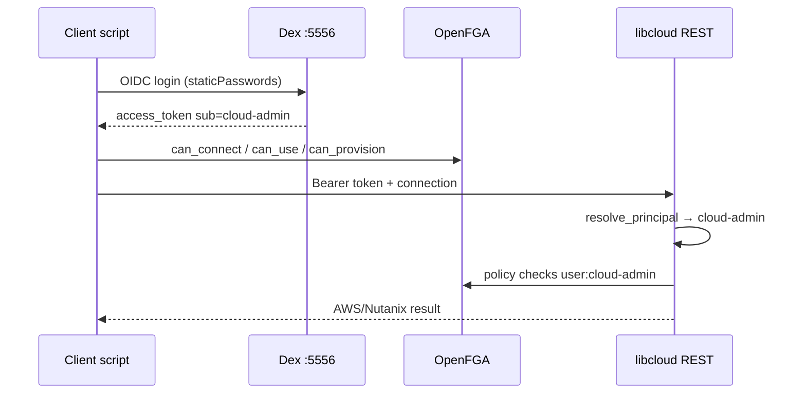

# Identity Architecture — Dex OIDC + Stable Principals + OpenFGA

This document implements the migration described in `prompt.md`: **Dex** is the long-lived OIDC abstraction; **OpenFGA** owns authorization; **libcloud REST** maps tokens to stable application principals.

---

## Phase 1 vs Phase 2

| Phase | Authentication source | Client impact |
|---|---|---|
| **Phase 1 (now)** | Dex LDAP connector → **LLDAP** (`../lldap`) | Clients use `issuer=http://localhost:5556/dex/`, `client_id=libcloud-rest` |
| **Phase 2 (future)** | Dex upstream connector (Entra ID, AD, …) | **Same issuer URL and client_id** — only Dex config + `principal_map.json` entries change |

Dex no longer stores users (`enablePasswordDB`/`staticPasswords` removed). The user directory is **LLDAP**; Dex authenticates against it over LDAP. Swap LLDAP for another upstream IdP later by changing only the Dex connector — `libcloud-rest`'s `client_id` and the issuer URL stay the same.

---

## Users (managed in LLDAP)

Created in LLDAP (`../lldap`, web UI at `http://localhost:17170`, admin login in `../lldap/.env`) via `scripts/create-user.sh`:

| LLDAP `uid` | Email | Password (demo) | OIDC `sub` | OpenFGA principal | Access |
|---|---|---|---|---|---|
| `cloud-admin` | `cloud-admin@libcloud.local` | `CloudAdmin123!` | Dex LDAP `sub` (encoded) | `user:cloud-admin` | Full provision + read |
| `cloud-readonly` | `cloud-readonly@libcloud.local` | `CloudRead123!` | Dex LDAP `sub` (encoded) | `user:cloud-readonly` | Read only |
| `cloud-denied` | `cloud-denied@libcloud.local` | `CloudDenied123!` | Dex LDAP `sub` (encoded) | *(no tuples)* | JWT ok; OpenFGA denies |

The Dex LDAP connector maps `idAttr: uid` and `emailAttr: mail`. Dex emits an opaque/encoded `sub` for LDAP users, so libcloud REST resolves the principal via `principal_map.json` **`by_email`** (e.g. `cloud-admin@libcloud.local → cloud-admin`). `email` is the stable mapping key that survives IdP migrations.

---

## Claim set libcloud REST trusts

**Minimal trusted claims from Dex:**

| Claim | Use |
|---|---|
| `sub` | Upstream subject (mapped → principal) |
| `email` | Secondary mapping key (survives many IdP migrations) |
| `iss`, `aud`, `exp` | Token validation only |

**Do not** use Dex-local usernames or transient connector IDs as OpenFGA object keys.

Optional future claims (Phase 2): `groups`, `preferred_username` — map through `principal_map.json`, not directly to OpenFGA.

---

## Stable principal mapping (concrete recommendation)

```
OIDC token (sub, email, …)
        │
        ▼
  principal_map.json  +  legacy_username_aliases
        │
        ▼
  principal slug: cloud-admin | cloud-readonly | cloud-denied
        │
        ├──► JWT TokenClaims.sub = principal
        ├──► Scope table (identity.py PRINCIPAL_SCOPES)
        └──► OpenFGA checks user:{principal}
```

**Files:**

- `openfga_my/data/principal_map.json` — source of truth for ops
- `libcloud.rest/data/principal_map.json` — loaded by API (`PRINCIPAL_MAP_FILE`)
- `libcloud.rest/app/auth/identity.py` — resolver + audit log

**Resolution order** (`resolve_principal`):

1. `by_sub[sub]` — required for Entra (`sub` = object GUID)
2. `by_email[email]` — stable when HR email unchanged
3. `legacy_username_aliases[preferred_username]`
4. `sub` if already a known principal slug (Phase 1 Dex)
5. Fail closed if unmapped

### Phase 2 example (`principal_map.json`)

```json
{
  "by_sub": {
    "8f3b2e1a-0000-4000-8000-000000000001": "cloud-admin"
  },
  "by_email": {
    "admin@company.com": "cloud-admin",
    "cloud-admin@libcloud.local": "cloud-admin"
  }
}
```

OpenFGA tuples stay `user:cloud-admin` — **no tuple rewrite** when IdP changes.

---

## Tradeoffs: sub vs email vs groups vs external ID

| Identifier | Pros | Cons |
|---|---|---|
| **`sub` (mapped)** | OIDC standard; works with Entra object ID | Opaque; changes if user re-created |
| **email** | Human-readable; easy bootstrap | Can change; not always unique |
| **immutable external ID** | Best long-term | Requires IdP support + mapping table |
| **group claims** | Good for coarse RBAC | Group renames break coupling; use groups to assign **roles**, not as OpenFGA user IDs |

**Recommendation:** OpenFGA `user:*` objects use **application principal slugs** (`cloud-admin`). Maintain a **mapping layer** from `(iss, sub)` and `email` → slug. Never bind tuples directly to Dex `sub` or Entra GUID without mapping.

---

## OpenFGA (unchanged model, updated principals)

Authorization model types are unchanged (`user`, `role`, `tenant`, `libcloud_api`, `provider`, …).

Seeded principals (see `openfga_bootstrap.py`):

```text
user:cloud-admin     member → role:admin, tenant:default
user:cloud-readonly  member → role:reader, tenant:default
user:cloud-denied    (no tuples — denied at can_connect)
```

Example check (unchanged semantics):

```json
{
  "tuple_key": {
    "user": "user:cloud-admin",
    "relation": "can_provision",
    "object": "aws_region:ap-southeast-1"
  }
}
```

---

## Dex configuration layout

| File | Purpose |
|---|---|
| `dex/config.template.yaml` | Phase 1 template (staticPasswords + static client) |
| `dex/config.yaml` | Rendered by `dex_bootstrap.py` (gitignored secret) |
| `dex/config.phase2.example.yaml` | Upstream Entra/Authentik connector sketch |
| `generated/dex.env` | Issuer, JWKS, client secret for libcloud + scripts |

---

## libcloud REST settings

After `./setup.sh`, merge into `../libcloud.rest/.env`:

```env
AUTH_MODE=oidc
OIDC_ENABLED=true
OIDC_ISSUER_URL=http://localhost:5556/dex/
OIDC_JWKS_URL=http://localhost:5556/dex/keys
OIDC_CLIENT_SECRET=<from generated/dex.env>
OIDC_AUDIENCE=libcloud-rest
PRINCIPAL_MAP_FILE=data/principal_map.json
AUTH_AUDIT_ENABLED=true
AUTH_AUDIT_FILE=data/auth_audit.log
FGA_ENABLED=true
# … FGA_STORE_ID, FGA_MODEL_ID from generated/fga.env
```

---

## Audit logging

| Layer | What is logged |
|---|---|
| **Dex** | JSON logs (`logger.format: json`) — auth requests, token issuance |
| **libcloud REST** | `data/auth_audit.log` — one JSON line per OIDC decode with `principal`, `subject`, `email`, `issuer` |

Example libcloud audit line:

```json
{"ts":"2026-06-24T12:00:00+00:00","event":"oidc_token_decoded","source":"oidc","principal":"cloud-admin","issuer":"http://localhost:5556/dex/","subject":"cloud-admin","email":"cloud-admin@libcloud.local"}
```

---

## Setup and demo commands

```bash
cd openfga_my
./setup.sh
# configure ../libcloud.rest/.env (see above)
LIBCLOUD_USER=cloud-admin ./scripts/provision_aws.sh
LIBCLOUD_USER=cloud-readonly ./scripts/provision_aws.sh
LIBCLOUD_USER=cloud-denied ./scripts/provision_aws.sh   # fails OpenFGA preflight
```

Legacy script aliases still work: `LIBCLOUD_USER=provisioner` → maps to `cloud-admin` credentials and principal.

---

## End-to-end flow



---

## Migrating to Phase 2 (checklist)

1. Add upstream connector in Dex (`dex/config.phase2.example.yaml`).
2. Disable `staticPasswords`; set `enablePasswordDB: false`.
3. Populate `principal_map.json` `by_sub` / `by_email` for each corporate identity.
4. **Do not** change libcloud OAuth client_id, redirect URIs, or OpenFGA tuple object names.
5. Run validation checks in `openfga_bootstrap.py` against mapped principals.
