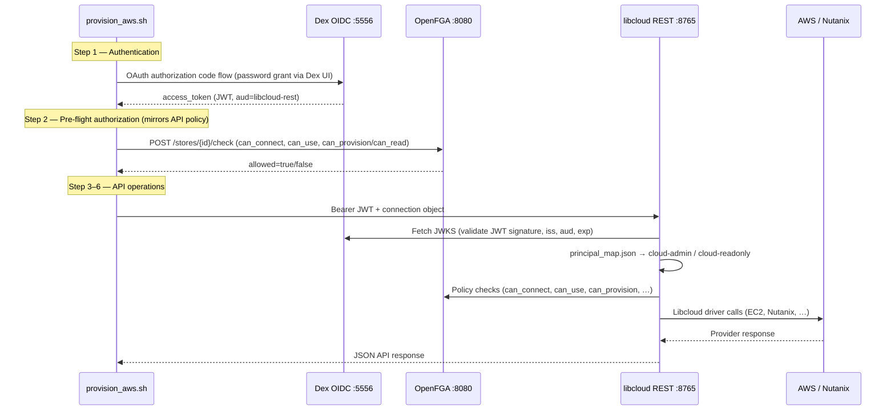

# Lessons Learned — Dex OIDC + OpenFGA + libcloud REST Demo Stack

This document captures bugs, fixes, operational caveats, and the end-to-end architecture flow discovered while getting `provision_aws.sh` working for `cloud-admin` and `cloud-readonly`.

Related docs: [ARCHITECTURE.md](ARCHITECTURE.md), [IDENTITY.md](IDENTITY.md), [authorization.md](authorization.md).

---

## Overall architecture flow

The demo stack separates **who you are** (Dex OIDC), **what you may do** (OpenFGA), and **how cloud work is done** (libcloud REST → Libcloud drivers → AWS/Nutanix).



### Layer responsibilities

| Layer | Question answered | Failure mode if misconfigured |
|---|---|---|
| **Dex** | Who authenticated? | Login fails, `invalid_client`, wrong password |
| **OpenFGA** | Is this principal allowed on this object/relation? | HTTP 400 (bad store/model) or `allowed=false` |
| **libcloud REST** | Is the JWT valid and mapped to scopes/providers? | 401/403/500 on `/v1/*` |
| **Libcloud drivers** | Can we talk to the cloud API? | Connection test or catalog errors (credentials, region, etc.) |

### Stable principals (design intent)

| Principal | Dex email | OpenFGA user | Typical relations |
|---|---|---|---|
| `cloud-admin` | `cloud-admin@libcloud.local` | `user:cloud-admin` | `can_connect`, `can_use`, `can_provision` |
| `cloud-readonly` | `cloud-readonly@libcloud.local` | `user:cloud-readonly` | `can_connect`, `can_use`, `can_read` |
| `cloud-denied` | `cloud-denied@libcloud.local` | *(no tuples)* | Denied at `can_connect` |

Scripts and OpenFGA use **principal slugs**, not raw Dex `sub` strings. libcloud REST resolves JWT claims → principal via `data/principal_map.json` (by email, by_sub, or legacy aliases).

---

## Bugs discovered

### 1. Dex `invalid_client` on token exchange (401)

**Symptom:** Password login appears to succeed; script fails with:

```text
IdP login failed (dex): Dex token exchange failed (invalid_client): LIBCLOUD_OIDC_CLIENT_SECRET does not match dex/config.yaml
```

**Root cause:** Dex loads `staticClients.secret` **only at startup** (in-memory storage). Updating `dex/config.yaml` or `generated/dex.env` without restarting Dex leaves a stale secret in the running container.

**Secondary cause:** A stale `LIBCLOUD_OIDC_CLIENT_SECRET` exported in the parent shell (or an empty line in `.env`) overrode the correct value from `generated/dex.env`.

**What did not work:** Editing config files alone, or clearing token cache without restarting Dex.

**What worked:** `docker compose restart dex` (or `./setup.sh` which force-recreates Dex after bootstrap).

---

### 2. `curl_http` dropped Authorization headers (`Bearer token required`)

**Symptom:** Dex login and OpenFGA checks passed, but every libcloud REST call returned:

```json
{"error": {"code": "auth_invalid_token", "message": "Bearer token required"}}
```

**Root cause:** Bug in `scripts/common.sh` — the `curl_http` helper appended `-H` to curl args but **never appended the header value**, producing `curl ... -H -H` instead of `curl ... -H "Authorization: Bearer …"`.

**What did not work:** Retrying login, refreshing tokens, or changing OIDC settings (the token never reached the API).

**What worked:** Fix the header loop to pass both `-H` and the header string as a pair.

---

### 3. Stale shell environment overrides (`FGA_*`, `LIBCLOUD_OIDC_CLIENT_SECRET`)

**Symptom:** Intermittent failures — login `invalid_client`, OpenFGA HTTP 400 `authorization_model_not_found`, checks against wrong store IDs.

**Root cause:** `_load_env_file` only set variables when unset/empty. Parent shells (IDE terminals, CI, prior script exports) kept old `FGA_STORE_ID`, `FGA_MODEL_ID`, and `LIBCLOUD_OIDC_CLIENT_SECRET` values that did not match the current bootstrap output.

**What worked:** Force-load `generated/dex.env`, `generated/fga.env`, and `generated/authentik.env` so they **always win** over inherited shell exports.

---

### 4. libcloud REST container could not reach Dex JWKS (HTTP 500)

**Symptom:** Host-side curl with a valid token returned `Internal Server Error`; container logs showed:

```text
PyJWKClientConnectionError: Fail to fetch data from the url, err: Connection refused
```

**Root cause:** `libcloud-rest-api` runs in Docker. Its `.env` used `OIDC_JWKS_URL=http://localhost:5556/dex/keys`. Inside the container, `localhost` is the container itself, not the host where Dex listens.

**What did not work:** Only updating host-side `.env` without container-specific URL overrides.

**What worked:**
- Set `OIDC_JWKS_URL=http://host.docker.internal:5556/dex/keys` for the container.
- Set `FGA_API_URL=http://host.docker.internal:8080` for server-side FGA calls from the container.
- Keep `OIDC_ISSUER_URL=http://localhost:5556/dex` **without trailing slash** — must match the `iss` claim in Dex JWTs (issuer URL ≠ JWKS fetch URL).

Hardcoded overrides in `libcloud.rest/docker-compose.yml` prevent host-shell variable substitution from reverting to `localhost`.

---

### 5. OIDC issuer trailing-slash mismatch

**Symptom:** JWT validation failed when issuer was configured as `http://localhost:5556/dex/` but Dex tokens carried `iss: http://localhost:5556/dex`.

**Root cause:** PyJWT issuer validation is strict about trailing slashes.

**What worked:** Normalize issuer to no trailing slash in `dex_bootstrap.py`, `generated/dex.env`, and `libcloud.rest/.env`; strip trailing slash in `oidc_service.py` decode paths.

---

### 6. Missing `principal_map.json` in libcloud data volume (`auth_user_unknown`)

**Symptom:**

```json
{
  "code": "auth_user_unknown",
  "message": "OIDC principal is not mapped to libcloud permissions",
  "details": {"principal": "CgtjbG91ZC1hZG1pbhIFbG9jYWw", "sub": "CgtjbG91ZC1hZG1pbhIFbG9jYWw"}
}
```

**Root cause:** `PRINCIPAL_MAP_FILE=data/principal_map.json` resolves to `/app/data/principal_map.json` in the container. The Docker volume under `/app/data` had `users.json` and `connections.json` but **never received** `principal_map.json` from the image seed directory. `_load_map()` fell back to empty `by_email` / `by_sub` maps; resolution returned the opaque Dex `sub`, which has no scopes.

**Note:** Dex may emit a base64-style `sub` even when `userID` is set in config. Email-based mapping in `principal_map.json` is therefore **required**, not optional.

**What worked:** Seed `/app/data` from `/app/data-seed` in `docker/entrypoint.sh` on first run; copy/update `principal_map.json` into the volume.

---

### 7. Wrong password for `cloud-readonly` (Dex 401 on login)

**Symptom:** `cloud-admin` login succeeded; immediate next run with `LIBCLOUD_USER=cloud-readonly` failed with Dex HTTP 401 on the password POST.

**Root cause:** `common.sh` used `LIBCLOUD_PASSWORD="${LIBCLOUD_PASSWORD:-…}"`. After an admin run, `LIBCLOUD_PASSWORD=CloudAdmin123!` remained exported in the shell, so the readonly user attempted login with the **admin password**.

**What worked:** Always derive password from `LIBCLOUD_USER` via `LIBCLOUD_PASSWORD_CLOUD_*` variables — do not reuse a generic `LIBCLOUD_PASSWORD` left in the environment.

---

### 8. PyJWT / signing-key API variance (container 500 risk)

**Symptom:** Local Python tests hit `AttributeError: 'PyJWK' object has no attribute 'algorithm_name'`.

**Root cause:** Different PyJWT versions expose signing-key metadata differently.

**What worked:** Read `alg` from `jwt.get_unverified_header(token)` instead of relying on `signing_key.algorithm_name`.

---

## Changes made

### `openfga_my/scripts/common.sh`

| Change | Purpose |
|---|---|
| `_load_env_file … 1` for `generated/*.env` | Generated bootstrap output overrides stale shell exports |
| Fixed `curl_http` `-H` handling | Authorization headers actually sent to libcloud REST |
| Password always from `LIBCLOUD_PASSWORD_CLOUD_*` per user | Prevents cross-user password bleed |

### `openfga_my/scripts/idp_login.py`

| Change | Purpose |
|---|---|
| Clearer `invalid_client` error message | Points to Dex restart / `./setup.sh` |
| Delete stale token cache on 401 refresh | Avoids retry loops with dead refresh tokens |

### `openfga_my/dex_bootstrap.py` + `setup.sh`

| Change | Purpose |
|---|---|
| Issuer URLs without trailing slash | Match Dex JWT `iss` claim |
| `setup.sh` force-recreates Dex after bootstrap | Running container matches rendered `dex/config.yaml` |

### `libcloud.rest/app/auth/oidc_service.py`

| Change | Purpose |
|---|---|
| Issuer `.rstrip("/")` on decode | Tolerate config drift |
| Algorithm from JWT header | Compatible across PyJWT versions |

### `libcloud.rest/.env` + `docker-compose.yml`

| Change | Purpose |
|---|---|
| `OIDC_JWKS_URL` / `FGA_API_URL` → `host.docker.internal` (container) | Reach host-published Dex and OpenFGA |
| Compose `environment:` hardcodes container URLs | Prevents `.env` localhost from breaking in-container fetches |
| `OIDC_ISSUER_URL=http://localhost:5556/dex` | Match token `iss` (public issuer, not internal JWKS host) |

### `libcloud.rest/docker/entrypoint.sh`

| Change | Purpose |
|---|---|
| Copy missing files from `data-seed/` → `data/` | Ensures `principal_map.json` exists in persistent volume |

---

## What worked vs what did not

| Approach | Result |
|---|---|
| Restart Dex after secret/config change | ✅ Fixed `invalid_client` |
| Clear `generated/tokens/*.json` after secret rotation | ✅ Avoids stale refresh tokens |
| Re-run `./setup.sh` for fresh FGA store/model + tuples | ✅ Fixes OpenFGA 400 / wrong store ID |
| Rebuild/recreate `libcloud-rest-api` after code + `.env` changes | ✅ Fixed JWKS 500 and principal mapping |
| Only editing files on disk without restarting services | ❌ Dex, libcloud container, and FGA memory store stay stale |
| Assuming `localhost` URLs work inside Docker containers | ❌ JWKS and FGA unreachable from libcloud container |
| Relying on Dex `sub` alone without `principal_map.json` | ❌ Opaque `sub` → no scopes |
| Trusting inherited `LIBCLOUD_PASSWORD` / `FGA_*` shell exports | ❌ Wrong user password and wrong FGA store |

### Final verified flows

```bash
LIBCLOUD_USER=cloud-admin ./scripts/provision_aws.sh
# Dex login → FGA can_connect/can_use/can_provision → /v1/auth/me (provisioner scopes) → AWS catalog

LIBCLOUD_USER=cloud-readonly ./scripts/provision_aws.sh
# Dex login → FGA can_connect/can_use/can_read → /v1/auth/me (reader scopes) → exits before mutating calls
```

Both completed with exit code 0 after all fixes.

---

## Caveats

### Dex

- **In-memory storage:** Users, clients, and secrets exist only in the running process. Config file edits require **container restart**.
- **`staticPasswords` is demo-only:** Replace with upstream IdP (Phase 2) before production.
- **Issuer URL is a public contract:** Clients and JWT validation must agree on `iss` exactly (watch trailing slashes).

### OpenFGA

- **Demo compose uses in-memory datastore:** Store and model IDs change on full reset. Host scripts and libcloud `.env` must match `generated/fga.env` from the latest bootstrap.
- **Script pre-checks are advisory:** They mirror policy but libcloud REST performs its own FGA checks at request time.

### libcloud REST (Docker)

- **`localhost` inside container ≠ host:** Use `host.docker.internal` (or Docker network service names) for Dex JWKS, OpenFGA, and optionally Nutanix mock endpoints.
- **`OIDC_ISSUER_URL` must match JWT `iss`**, not the JWKS hostname.
- **Data volume persists across recreates:** Seed files (`principal_map.json`) are not auto-updated if the volume already exists — delete volume or manually copy updated maps.
- **Large catalog responses:** `provision_aws.sh` step 5 dumps full AWS image/size JSON — logs can be megabytes; this is output volume, not necessarily failure.

### Provisioning scripts

- **Token cache:** `generated/tokens/{user}.json` — delete after Dex secret rotation or client ID changes.
- **Environment pollution:** Do not export `LIBCLOUD_PASSWORD`, `FGA_STORE_ID`, or `LIBCLOUD_OIDC_CLIENT_SECRET` globally in `.bashrc` / CI unless intentionally pinned.
- **Legacy `.env` passwords** (`LIBCLOUD_READER_PASSWORD=Reader123!`) are **not** used for Dex users — Dex passwords come from `generated/dex.env` (`CloudRead123!`, etc.).

### Security (demo stack)

- Passwords and AWS keys in `.env` are for lab use only.
- Dex client secret is shared between Dex, scripts, and libcloud REST (confidential client pattern for demo).

---

## Future checks (runbook)

Use this checklist after `./setup.sh`, config edits, or container restarts.

### 1. Dex health and secret alignment

```bash
# Discovery reachable
curl -s http://localhost:5556/dex/.well-known/openid-configuration | python3 -m json.tool | head

# Secrets match (host)
grep LIBCLOUD_OIDC_CLIENT_SECRET openfga_my/generated/dex.env
grep 'secret:' openfga_my/dex/config.yaml

# Dex restarted after config render
docker compose -f openfga_my/docker-compose.yml ps dex
```

### 2. OpenFGA store/model alignment

```bash
grep -E 'FGA_STORE_ID|FGA_MODEL_ID' openfga_my/generated/fga.env
grep -E 'FGA_STORE_ID|FGA_MODEL_ID' ../libcloud.rest/.env

# Quick check tuple
source openfga_my/scripts/common.sh
fga_check user:cloud-admin can_connect libcloud_api:main
```

### 3. libcloud REST OIDC from inside container

```bash
docker exec libcloud-rest-api python3 -c "
from pathlib import Path
from app.config.settings import get_settings
s=get_settings()
print('issuer', s.oidc_issuer_url)
print('jwks', s.oidc_jwks_url)
print('fga', s.fga_api_url)
print('principal_map exists', Path(s.principal_map_file).is_file())
"

# JWKS reachable from container
docker exec libcloud-rest-api curl -fsS http://host.docker.internal:5556/dex/keys | head -c 200
```

### 4. End-to-end script smoke test

```bash
cd openfga_my
rm -f generated/tokens/*.json
LIBCLOUD_USER=cloud-admin ./scripts/provision_aws.sh 2>&1 | tee /tmp/admin.log
LIBCLOUD_USER=cloud-readonly ./scripts/provision_aws.sh 2>&1 | tee /tmp/readonly.log
grep -E 'error|failed|allowed=' /tmp/admin.log /tmp/readonly.log
```

**Expect:**
- Admin: `allowed=True` for connect/use/provision; `/v1/auth/me` shows `cloud-admin`.
- Readonly: `allowed=True` for connect/use/read; `/v1/auth/me` shows `cloud-readonly`; step 7 skips provisioning.

### 5. After Dex secret rotation

```bash
docker compose -f openfga_my/docker-compose.yml restart dex
rm -f openfga_my/generated/tokens/*.json
# Sync secret into libcloud.rest/.env (OIDC_CLIENT_SECRET / LIBCLOUD_OIDC_CLIENT_SECRET)
docker compose -f libcloud.rest/docker-compose.yml up -d --force-recreate api
```

### 6. After OpenFGA full reset

```bash
cd openfga_my && ./setup.sh
# Copy new FGA_STORE_ID / FGA_MODEL_ID into libcloud.rest/.env
docker compose -f ../libcloud.rest/docker-compose.yml up -d --force-recreate api
```

---

## Design takeaways

1. **Separate issuer URL from service reachability URL.** JWT `iss` is a logical identifier; JWKS/FGA endpoints are physical fetch URLs — they may differ when services run in Docker on the host.

2. **Stable principals decouple IdP from authorization.** OpenFGA tuples key off `user:cloud-admin`, not Dex `sub`. `principal_map.json` is the migration seam for Phase 2 (Entra/Authentik opaque subjects).

3. **Bootstrap generates truth in `generated/*.env`.** Treat those files as authoritative for scripts; force-load them over inherited shell state.

4. **Stateful containers need explicit restart/recreate discipline.** Dex (memory), OpenFGA (memory in demo), and libcloud (volume + env) all drift if only files on disk change.

5. **Test the full chain, not just login.** A green Dex login does not prove Bearer headers reach the API, JWKS is reachable from the API container, or principal mapping is loaded.

6. **Multi-user scripts need per-user credential isolation.** Never reuse a generic `LIBCLOUD_PASSWORD` export across different `LIBCLOUD_USER` values.

---

## Key file reference

| File | Role |
|---|---|
| `openfga_my/dex/config.yaml` | Dex runtime config (client secret, staticPasswords) |
| `openfga_my/generated/dex.env` | OIDC URLs + secrets for scripts |
| `openfga_my/generated/fga.env` | OpenFGA store/model IDs for scripts |
| `openfga_my/generated/tokens/*.json` | Cached OIDC tokens per user |
| `openfga_my/scripts/common.sh` | Env loading, curl helpers, FGA pre-checks |
| `openfga_my/scripts/idp_login.py` | Dex OAuth authorization-code login |
| `openfga_my/data/principal_map.json` | Host-side principal map (reference) |
| `libcloud.rest/data/principal_map.json` | Image seed for container |
| `libcloud.rest/.env` | libcloud REST + FGA + OIDC configuration |
| `libcloud.rest/docker-compose.yml` | Container URL overrides for host services |

---

*Last updated: June 2026 — reflects debugging session for `provision_aws.sh` with Dex IdP and Docker-hosted libcloud REST.*
