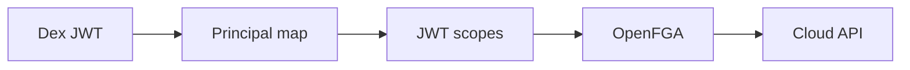
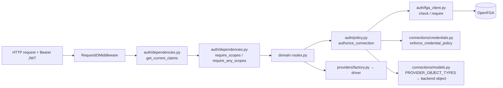

# OpenFGA Authorization Reference — libcloud REST

This document describes the **authorization layer** (OpenFGA) for the libcloud REST demo stack. Authentication is handled by **Dex OIDC** (users live in LLDAP); see [IDENTITY.md](IDENTITY.md) and [ARCHITECTURE.md](ARCHITECTURE.md) for the full flow.

**Design principle (per `privilege.md` / `privilege0.md`):** a platform-level `superadmin` bootstraps the system. Per-cloud **tenants** (`tenant:aws`, `tenant:nutanix`) carry `owner` / `admin` / `viewer` relations. Owners can assign admins/viewers; admins can provision and assign viewers; viewers can only enumerate. OpenFGA subjects are stable LLDAP `uid` slugs.

---

## 1. Authorization graph

```mermaid
flowchart TB
  subgraph platform [platform]
    P["platform:main"]
  end

  subgraph tenants [tenants]
    TAWS["tenant:aws"]
    TNTX["tenant:nutanix"]
  end

  subgraph principals [OpenFGA user objects]
    SA["user:superadmin"]
    AWO["user:aws-owner"]:::owner
    AW A["user:aws-admin"]:::admin
    AWV["user:aws-viewer"]:::viewer
    NOW["user:ntnx-owner"]:::owner
    NWA["user:ntnx-admin"]:::admin
    NWV["user:ntnx-viewer"]:::viewer
    CD["user:cloud-denied"]
  end

  subgraph providers [providers + API gateway]
    API["libcloud_api:main"]
    PA["provider:aws"]
    PN["provider:nutanix"]
  end

  subgraph backends [backend targets]
    AR["aws_region:ap-southeast-1"]
    NC["nutanix_cluster:lab"]
  end

  SA -->|superadmin| P
  SA -->|owner| TAWS
  SA -->|owner| TNTX
  AWO -->|owner| TAWS
  AW A -->|admin| TAWS
  AWV -->|viewer| TAWS
  NOW -->|owner| TNTX
  NWA -->|admin| TNTX
  NWV -->|viewer| TNTX

  TAWS -->|parent| API
  TNTX -->|parent| API
  TAWS -->|parent| PA
  TNTX -->|parent| PN

  PA -->|provider| AR
  TAWS -->|tenant| AR
  PN -->|provider| NC
  TNTX -->|tenant| NC

  CD -.->|no tuples| DENY["denied at can_connect"]
```

`user:cloud-denied` is authenticated in Dex but has **zero OpenFGA tuples** — all policy checks fail.

---

## 2. Object types and relations

| Object type | Demo instance(s) | Direct relations (stored tuples) | Computed relations (runtime checks) |
|---|---|---|---|
| `user` | `superadmin`, `aws-owner`, `aws-admin`, `aws-viewer`, `ntnx-owner`, `ntnx-admin`, `ntnx-viewer`, `cloud-denied`* | — | Used as check subject `user:{principal}` |
| `platform` | `main` | `superadmin` ← user | **`can_manage_platform`** |
| `tenant` | `aws`, `nutanix` | `owner`, `admin`, `viewer` ← user | **`member`**, **`can_assign_owner`**, **`can_assign_admin`**, **`can_assign_viewer`**, **`can_provision`**, **`can_read`** |
| `libcloud_api` | `main` | `parent` ← tenant | **`can_connect`** |
| `provider` | `aws`, `nutanix` | `parent` ← tenant, `allowed` ← user | **`can_use`** |
| `aws_region` | `ap-southeast-1` | `provider` ← provider, `tenant` ← tenant, `operator`/`viewer` ← user | **`can_read`**, **`can_provision`** |
| `nutanix_cluster` | `lab` | `provider` ← provider, `tenant` ← tenant, `operator`/`viewer` ← user | **`can_read`**, **`can_provision`** |

\*`cloud-denied` exists as an LLDAP/Dex user only; not seeded in OpenFGA.

### How computed relations are derived

| Relation | On object | Logic (simplified) |
|---|---|---|
| `can_manage_platform` | `platform:main` | `superadmin` |
| `member` | `tenant:*` | `this` or `owner` or `admin` or `viewer` |
| `can_assign_owner` | `tenant:*` | `owner` |
| `can_assign_admin` | `tenant:*` | `owner` |
| `can_assign_viewer` | `tenant:*` | `owner` or `admin` |
| `can_manage_credentials` | `tenant:*` | `owner` (only tenant owners — and superadmin as owner — may update that tenant's backend cloud credentials) |
| `can_provision` | `tenant:*` | `admin` or `owner` |
| `can_read` | `tenant:*` | `viewer` or `admin` or `owner` |
| `can_connect` | `libcloud_api:main` | Direct grant **or** tenant `member` via `parent` |
| `can_use` | `provider:*` | Direct grant **or** `allowed` **or** tenant `member` via `parent` |
| `can_read` | `aws_region` / `nutanix_cluster` | `viewer` **or** `operator` **or** tenant `viewer`/`admin`/`owner` via `tenant` **or** `can_use` on linked provider |
| `can_provision` | `aws_region` / `nutanix_cluster` | (`operator` **or** tenant `admin`/`owner` via `tenant`) **AND** `can_use` on linked provider |

The `tenant` relation on each backend object is what propagates per-cloud roles down to the backend, so an `aws-admin` can provision `aws_region:ap-southeast-1` but is denied on `nutanix_cluster:lab`.

Model source: `openfga_bootstrap.py` → `LIBCLOUD_MODEL`.

---

## 3. Principals, LLDAP users, and roles

| LLDAP `uid` | OpenFGA `user:*` | Tenant role(s) | Effective access |
|---|---|---|---|
| `superadmin` | `user:superadmin` | `superadmin` on `platform:main`; `owner` on both tenants | Platform bootstrap + full cloud access (break-glass) |
| `aws-owner` | `user:aws-owner` | `owner` on `tenant:aws` | Provision + read AWS; assign aws-admin/viewer |
| `aws-admin` | `user:aws-admin` | `admin` on `tenant:aws` | Provision + read AWS; assign aws-viewer |
| `aws-viewer` | `user:aws-viewer` | `viewer` on `tenant:aws` | Enumerate AWS only |
| `ntnx-owner` | `user:ntnx-owner` | `owner` on `tenant:nutanix` | Provision + read Nutanix; assign ntnx-admin/viewer |
| `ntnx-admin` | `user:ntnx-admin` | `admin` on `tenant:nutanix` | Provision + read Nutanix; assign ntnx-viewer |
| `ntnx-viewer` | `user:ntnx-viewer` | `viewer` on `tenant:nutanix` | Enumerate Nutanix only |
| `cloud-denied` | *(none)* | — | Authenticated; denied at `can_connect` |

### superadmin gating

`superadmin` is the bootstrap identity. After a successful Dex OIDC login as `superadmin`, the resulting JWT (`SUPERADMIN_JWT`) gates:

- **Vault** — `vault_bootstrap.py` refuses to initialize/configure Vault without it.
- **OpenFGA** — `openfga_bootstrap.py` refuses to write the model / privilege tuples without it.
- **LLDAP user CRUD** — `setup.sh` performs per-cloud user creation only after `superadmin_auth.sh` succeeds.

Gating helper: `scripts/superadmin_auth.sh` (login) + `scripts/verify_superadmin_jwt.py` (signature + claim check against Dex JWKS).

### Per-tenant backend credentials (owner-only)

Backend cloud credentials are **per-tenant**, not global. Each tenant maps to its own Vault path and its own OpenFGA backend object, so different AWS (or Nutanix) tenants use different access keys / secrets:

| Tenant | Vault path | Backend object | Fields | Written by |
|---|---|---|---|---|
| `tenant:aws` | `secret/data/libcloud/aws` | `aws_region:aws` | `key`, `secret` | `aws-owner` (or `superadmin`) |
| `tenant:nutanix` | `secret/data/libcloud/nutanix` | `nutanix_cluster:nutanix` | `key`, `secret` | `ntnx-owner` (or `superadmin`) |
| `tenant:aws-dev` (example) | `secret/data/libcloud/aws-dev` | `aws_region:aws-dev` | `key`, `secret` | `aws-dev-owner` |

`scripts/set_tenant_credentials.py` writes a tenant's secret: it logs the caller in to Dex, checks `can_manage_credentials` on the target tenant (owner-only), then writes to `secret/data/libcloud/<tenant>`. admins and viewers are denied.

`scripts/create_tenant.sh` (superadmin-gated) mints a new tenant: it creates the tenant's owner/admin/viewer LLDAP users, the OpenFGA tuples (`tenant:<id>` membership + `parent` provider/api + `provider`/`tenant` backend relations), and the per-tenant backend object `<backend_type>:<id>`. The `auth_binding` sent by client scripts (`aws` / `nutanix` / `aws-dev` / …) selects which tenant's backend object and Vault secret are used.

> **libcloud REST follow-up:** for libcloud REST to enforce per-tenant isolation end-to-end, `app/auth/policy.py` must derive the OpenFGA backend object from `connection.auth_binding` (e.g. `aws_region:{auth_binding}`) instead of from `connection.config.region`. Until then, the scripts' `fga_check` calls demonstrate correct per-tenant authz, but libcloud REST's own enforcement still keys on region.

---

## 4. Effective permissions matrix

Results from the **25 bootstrap validation checks** in `openfga_bootstrap.py`:

| Principal | `can_manage_platform` | `can_connect` | `can_use` AWS/NTNX | `can_provision` AWS | `can_read` AWS | `can_provision` NTNX | `can_read` NTNX |
|---|---|---|---|---|---|---|---|
| `superadmin` | ✓ | ✓ | ✓ / ✓ | ✓ | ✓ | ✓ | ✓ |
| `aws-owner` | ✗ | ✓ | ✓ / ✗ | ✓ | ✓ | ✗ | ✗ |
| `aws-admin` | ✗ | ✓ | ✓ / ✗ | ✓ | ✓ | ✗ | ✗ |
| `aws-viewer` | ✗ | ✓ | ✓ / ✗ | ✗ | ✓ | ✗ | ✗ |
| `ntnx-owner` | ✗ | ✓ | ✗ / ✓ | ✗ | ✗ | ✓ | ✓ |
| `ntnx-admin` | ✗ | ✓ | ✗ / ✓ | ✗ | ✗ | ✓ | ✓ |
| `ntnx-viewer` | ✗ | ✓ | ✗ / ✓ | ✗ | ✗ | ✗ | ✓ |
| `cloud-denied` | ✗ | ✗ | ✗ / ✗ | ✗ | ✗ | ✗ | ✗ |

Cross-cloud isolation is enforced: an AWS tenant member is **not** a member of `tenant:nutanix`, so `can_use provider:nutanix` and `can_provision nutanix_cluster:lab` both fail.

Delegated administration checks: `aws-owner` / `superadmin` satisfy `can_assign_admin` on `tenant:aws`; `aws-admin` does **not**. `aws-admin` satisfies `can_assign_viewer`; `aws-viewer` does **not**.

---

## 5. Seeded tuples (17 total)

| Category | Count | Examples |
|---|---|---|
| Platform superadmin | 1 | `user:superadmin` → `superadmin` → `platform:main` |
| superadmin → tenant owner (break-glass) | 2 | `user:superadmin` → `owner` → `tenant:aws` |
| Tenant owner/admin/viewer | 6 | `user:aws-admin` → `admin` → `tenant:aws` |
| Tenant → API gateway `parent` | 2 | `tenant:aws` → `parent` → `libcloud_api:main` |
| Tenant → provider `parent` | 2 | `tenant:aws` → `parent` → `provider:aws` |
| Provider → backend `provider` | 2 | `provider:aws` → `provider` → `aws_region:ap-southeast-1` |
| Tenant → backend `tenant` (role propagation) | 2 | `tenant:aws` → `tenant` → `aws_region:ap-southeast-1` |

Source: `INITIAL_TUPLES` in `openfga_bootstrap.py`.

---

## 6. Runtime checks — who calls OpenFGA?

| Caller | HTTP | Relations checked | When |
|---|---|---|---|
| `openfga_bootstrap.py` | `POST /stores/{id}/check` | All 25 cases in `VALIDATION_CHECKS` | After bootstrap |
| `scripts/common.sh` | `POST …/check` | `can_connect`, `can_use`, `can_provision` or `can_read` | Step 2 of provision scripts |
| libcloud REST `policy.py` | `POST …/check` | Same as above on `user:{TokenClaims.sub}` | Every compute/network route with a `connection` |

### libcloud REST check sequence (`PolicyEngine._enforce_openfga`)

For each request with a provider connection:

1. **`can_connect`** on `libcloud_api:main`
2. **`can_use`** on `provider:{aws|nutanix}`
3. **Write scopes** (`compute:node:create`, `*:manage`, …) → **`can_provision`** on backend
4. **Read scopes** → **`can_read`** on backend (fallback **`can_provision`** if read fails)

Backend object mapping (`policy.py`):

| `connection.provider` | OpenFGA backend object |
|---|---|
| `aws` | `aws_region:{region}` (default `ap-southeast-1`) |
| `nutanix` | `nutanix_cluster:{cluster}` (default `lab`) |

### Routes that skip OpenFGA

| Route | Checks |
|---|---|
| `GET /v1/auth/me` | JWT only |
| `POST /v1/connections:test` | JWT scope only (`compute:read`) |
| `POST /v1/auth/login` | Local auth (no OpenFGA) |

> **Note:** for the new per-cloud principals (`aws-admin`, `ntnx-viewer`, …) to flow end-to-end through libcloud REST, `../libcloud.rest/data/principal_map.json` and `app/auth/identity.py` (`PRINCIPAL_SCOPES`) must be updated to recognize them. The OpenFGA side is correct independently of that.

---

## 7. Three authorization layers (how checks stack)



| Layer | Question | Answered by |
|---|---|---|
| 1 | Who is calling? | Dex OIDC → LLDAP uid → principal slug |
| 2 | May they call this API operation? | libcloud JWT scopes (`identity.py`) |
| 3 | May they use this provider/backend? | OpenFGA `can_connect` / `can_use` / `can_provision` / `can_read` |
| 4 | How do we reach the cloud? | libcloud REST server-side identity → Vault credential → libcloud driver |

---

## 8. Example OpenFGA check payloads

### Allow — aws-admin provisions AWS

```json
POST /stores/{FGA_STORE_ID}/check

{
  "authorization_model_id": "{FGA_MODEL_ID}",
  "tuple_key": {
    "user": "user:aws-admin",
    "relation": "can_provision",
    "object": "aws_region:ap-southeast-1"
  }
}
```

Response: `{ "allowed": true }`

### Deny — aws-admin attempts Nutanix (cross-cloud)

```json
{
  "tuple_key": {
    "user": "user:aws-admin",
    "relation": "can_provision",
    "object": "nutanix_cluster:lab"
  }
}
```

Response: `{ "allowed": false }`

### Deny — cloud-denied connects to API

```json
{
  "tuple_key": {
    "user": "user:cloud-denied",
    "relation": "can_connect",
    "object": "libcloud_api:main"
  }
}
```

Response: `{ "allowed": false }`

---

## 9. Identity → OpenFGA wiring

```
Dex token sub=aws-admin
  → libcloud resolve_principal() → TokenClaims.sub = aws-admin
  → policy._fga_user() → "user:aws-admin"
  → OpenFGA Check(user:aws-admin, can_provision, aws_region:ap-southeast-1)
```

---

## 10. Maintenance

| Task | Command / file |
|---|---|
| Re-seed tuples + validate | `./setup.sh` or `SUPERADMIN_JWT=… python openfga_bootstrap.py` |
| Add a new per-cloud user | 1) superadmin login 2) create LLDAP user 3) add owner/admin/viewer tuple on the tenant |
| Update a tenant's AWS/Nutanix creds | `TENANT=aws LIBCLOUD_USER=aws-owner … python3 scripts/set_tenant_credentials.py` (owner-only) |
| Create a new per-cloud tenant | `TENANT=aws-dev CLOUD=aws ./scripts/create_tenant.sh` (superadmin-gated) |
| Add AWS region | New `aws_region:{id}` object + `provider` + `tenant` tuples |
| Change superadmin password | Reset in LLDAP, update `generated/dex.env`, re-run `superadmin_auth.sh` |

---

## 11. Roles, privileges, and how they are wired to URLs

This section is the operator-facing catalog: which **roles** exist, which
**privileges** each role carries, the **APIs used to assign** those privileges,
and — in §12 — the exact `../libcloud.rest` files that **enforce** them when a
URL is hit.

The system has **two independent privilege dimensions** that compose at request
time:

1. **JWT scopes** (operation-level: "may this role call *this kind* of API
   operation?") — granted by role in `../libcloud.rest/app/auth/identity.py`.
2. **OpenFGA relations** (resource-level: "may this role use *this* provider /
   backend / tenant?") — granted by tuple in OpenFGA, seeded by
   `openfga_bootstrap.py` and the `scripts/` helpers.

A URL is authorized only when **both** dimensions pass (see §7 for the layer
stack). Roles are **never** attached to URLs directly; scopes are.

### 11.1 Role catalog

| Role | Where it lives | OpenFGA relation(s) held | JWT scope set (`identity.py`) | Provider set | Effective reach |
|---|---|---|---|---|---|
| `superadmin` | `platform:main` | `superadmin` on platform; `owner` on every tenant (break-glass) | `PROVISIONER_SCOPES` | `["*"]` | All clouds, all operations; can bootstrap & assign owners |
| `<tenant>-owner` (e.g. `aws-owner`, `ntnx-owner`, `aws-dev-owner`) | `tenant:<id>` | `owner` on its tenant | `PROVISIONER_SCOPES` | own cloud only (OpenFGA `can_use`) | Full access to its cloud; can assign admins & viewers; can set backend credentials (`can_manage_credentials`) |
| `<tenant>-admin` (e.g. `aws-admin`, `ntnx-admin`) | `tenant:<id>` | `admin` on its tenant | `PROVISIONER_SCOPES` | own cloud only | Provision + read its cloud; can assign viewers; **cannot** assign admins or set creds |
| `<tenant>-viewer` (e.g. `aws-viewer`, `ntnx-viewer`) | `tenant:<id>` | `viewer` on its tenant | `READER_SCOPES` | own cloud only | Enumerate (read-only) its cloud; cannot mutate, cannot assign |
| `cloud-denied` | LLDAP only | *(no OpenFGA tuples)* | `READER_SCOPES` | `["aws","nutanix"]` | Authenticated, but every OpenFGA `can_connect`/`can_use` check fails → 403 |
| `admin` (legacy, local-auth only) | local user store | — | `ALL_SCOPES` | `["*"]` | Only when `auth_mode=local`; disabled under OIDC |

> Per-cloud principal names follow the **role-suffix convention**
> `<tenant>-owner` / `<tenant>-admin` / `<tenant>-viewer`. The suffix is
> recognized by `_role_suffix()` in `identity.py`, so a freshly-created tenant
> (e.g. `aws-dev`) gets the correct scopes **without** editing
> `PRINCIPAL_SCOPES`. Explicit entries in `PRINCIPAL_SCOPES` /
> `PRINCIPAL_PROVIDERS` still win.

### 11.2 Privilege catalog (what each role can actually do)

| Privilege | OpenFGA relation | Held by | JWT scope(s) required to exercise it |
|---|---|---|---|
| Bootstrap platform (write model, seed tuples, gate Vault/LLDAP) | `superadmin` on `platform:main` | `superadmin` only | — (gated by `SUPERADMIN_JWT`, not a REST scope) |
| Connect to the REST API at all | `can_connect` on `libcloud_api:main` | any tenant `member` (owner/admin/viewer) + superadmin | any valid scope |
| Use a cloud provider | `can_use` on `provider:<cloud>` | tenant members via `parent`; superadmin; direct `allowed` grants | a scope whose provider matches |
| Provision / mutate a backend | `can_provision` on `<backend_type>:<id>` | tenant `admin`/`owner` (via `tenant` relation) + backend `operator`; superadmin | a write scope (`*:manage` / `*:create` / `*:delete`) — see `WRITE_SCOPES` |
| Enumerate / read a backend | `can_read` on `<backend_type>:<id>` | tenant `viewer`/`admin`/`owner` + backend `viewer`/`operator`; superadmin | a read scope (`*:read`) |
| Assign a tenant owner | `can_assign_owner` on `tenant:<id>` | `owner` (incl. superadmin-as-owner) | — (admin action, not a REST route) |
| Assign a tenant admin | `can_assign_admin` on `tenant:<id>` | `owner` | — |
| Assign a tenant viewer | `can_assign_viewer` on `tenant:<id>` | `owner` or `admin` | — |
| Set a tenant's backend credentials (Vault) | `can_manage_credentials` on `tenant:<id>` | `owner` only (incl. superadmin-as-owner) | — |

Computed-relation derivation logic is in `openfga_bootstrap.py` →
`LIBCLOUD_MODEL` (source of truth) and summarized in §2.

### 11.3 The URL → role binding model

There is **no per-URL role table**. A URL is bound to roles **indirectly** via
the scope it declares:

```
URL (route)  ──declares──▶  scope  ──granted to──▶  role  ──holds──▶  OpenFGA relation
  routes.py            identity.py                role suffix            policy.py
```

Concretely, a route picks its scope with `require_scopes(...)` /
`require_any_scopes(...)`; the scope's presence in `PROVISIONER_SCOPES` vs
`READER_SCOPES` decides which roles can pass Layer 2; and the scope's
membership in `WRITE_SCOPES` vs read scopes decides which OpenFGA relation
(`can_provision` vs `can_read`) Layer 3 checks. See
[how_to_add_new_endpoint.md](how_to_add_new_endpoint.md) for the full
procedure.

### 11.4 APIs used to ASSIGN privileges

Privileges are assigned in **two stores**, by **two kinds of APIs**.

#### A. Assign OpenFGA relations (resource privileges) — the tuple APIs

These grant a *user* a *relation* on an *object*. They are OpenFGA REST calls;
the helper scripts wrap them.

| Operation | HTTP | Body shape | Used by |
|---|---|---|---|
| Grant a relation (assign a role) | `POST /stores/{FGA_STORE_ID}/write` | `{"authorization_model_id":"…","writes":{"tuple_keys":[{"user":"user:aws-admin","relation":"admin","object":"tenant:aws"}, …]}}` | `openfga_bootstrap.py::_seed_tuples`; `scripts/create_tenant.sh` |
| Revoke a relation | `POST /stores/{FGA_STORE_ID}/write` | same shape with `"deletes":{"tuple_keys":[…]}` | operator / `scripts/` (manual) |
| Verify a granted relation | `POST /stores/{FGA_STORE_ID}/check` | `{"tuple_key":{"user":"…","relation":"…","object":"…"}}` | `openfga_bootstrap.py::validate`; `scripts/common.sh::fga_check`; `../libcloud.rest/app/auth/fga_client.py` |
| List existing grants | `POST /stores/{FGA_STORE_ID}/read` | `{"page_size":100, "continuation_token":"…"}` | `openfga_bootstrap.py::_read_all_tuples` |

Typical grants written by the bootstrap / tenant scripts (the "assignment
recipes"):

| To assign this | Write this tuple |
|---|---|
| `superadmin` | `user:superadmin` `superadmin` `platform:main` |
| break-glass owner on a tenant | `user:superadmin` `owner` `tenant:<id>` |
| a tenant owner | `user:<id>-owner` `owner` `tenant:<id>` |
| a tenant admin | `user:<id>-admin` `admin` `tenant:<id>` |
| a tenant viewer | `user:<id>-viewer` `viewer` `tenant:<id>` |
| tenant → API gateway | `tenant:<id>` `parent` `libcloud_api:main` |
| tenant → provider | `tenant:<id>` `parent` `provider:<cloud>` |
| provider → backend | `provider:<cloud>` `provider` `<backend_type>:<id>` |
| tenant → backend (role propagation) | `tenant:<id>` `tenant` `<backend_type>:<id>` |

Higher-level operator wrappers around these calls:

| Task | Command / file | OpenFGA calls made |
|---|---|---|
| Seed model + all default tuples, then validate 25 checks | `SUPERADMIN_JWT=… python openfga_bootstrap.py` (or `./setup.sh`) | `write` (INITIAL_TUPLES) + `check` (VALIDATION_CHECKS) |
| Mint a new tenant + its owner/admin/viewer grants atomically | `TENANT=<id> CLOUD=<cloud> ./scripts/create_tenant.sh` (superadmin-gated) | `write` (9 tuples per tenant) |
| Set a tenant's backend creds (owner-only, gated by `can_manage_credentials`) | `TENANT=<id> CLOUD=<cloud> LIBCLOUD_USER=<id>-owner … python3 scripts/set_tenant_credentials.py` | `check` `can_manage_credentials` before writing to Vault |
| Login as superadmin + verify JWT | `scripts/superadmin_auth.sh` + `scripts/verify_superadmin_jwt.py` | — (auth gating, not tuple writes) |

#### B. Assign JWT scopes (operation privileges) — the identity config

Operation-level privileges (which API operations a role may call) are **not**
stored in OpenFGA; they are derived from the role suffix in
`../libcloud.rest/app/auth/identity.py` and stamped into the JWT at login time
by `../libcloud.rest/app/auth/oidc_service.py` / `auth/service.py`.

| To assign this | Edit this | Effect |
|---|---|---|
| A new **write** operation to owner/admin | `PROVISIONER_SCOPES` in `identity.py` | All `*-owner`/`*-admin`/`superadmin` JWTs get the scope |
| A new **read** operation to viewers | `READER_SCOPES` in `identity.py` | All `*-viewer` JWTs get the scope |
| A new scope name itself | `ALL_SCOPES` in `connections/models.py`; `WRITE_SCOPES` or `READ_SCOPE_ALIASES` in `policy.py` | Scope is recognized by the gate and routed to the right OpenFGA relation |
| A non-suffix principal's scopes/providers | `PRINCIPAL_SCOPES` / `PRINCIPAL_PROVIDERS` in `identity.py` | Explicit override wins over suffix logic |

There is **no REST API** to assign JWT scopes to a role — they are code-config
and baked into the token at issuance. To change which roles can call a URL,
edit `identity.py` and restart the REST API.

---

## 12. Files that implement the authorization checks (libcloud.rest)

All runtime enforcement lives in `../libcloud.rest` (the `openfga_my` project
only *defines* and *seeds* the model). The check path is small and
registry-driven; below is every file that participates, in request order.



### 12.1 Authentication & scope gate (Layer 2)

| File | Role in the check path |
|---|---|
| `app/common/middleware.py` | `RequestIDMiddleware` — attaches request id; runs first. |
| `app/auth/dependencies.py` | The gate. `get_current_claims` decodes the Bearer JWT (local / OIDC / hybrid via `_decode_token`). `require_scopes(*s)` and `require_any_scopes(*s)` are FastAPI dependencies that raise `403 auth_insufficient_scope` if the token's `claims.scope` does not include the route's required scope. **This is the file a new URL imports to declare its scope.** |
| `app/auth/oidc_service.py` | OIDC token decode + `resolve_principal()` (calls `identity.py`) + scope/provider stamping into `TokenClaims`. |
| `app/auth/service.py` | Local-auth equivalent (only when `auth_mode=local`); mints tokens with `ALL_SCOPES` for the legacy `admin`. |
| `app/auth/models.py` | `TokenClaims` (sub, scope, allowed_providers, tenant_id, jti, session_id) — the data structure passed through the check path. |

### 12.2 Identity → scope/provider resolution (Layer 2 data)

| File | Role in the check path |
|---|---|
| `app/auth/identity.py` | **The role → privilege table.** `PRINCIPAL_SCOPES` / `PRINCIPAL_PROVIDERS` for explicit principals; `PROVISIONER_SCOPES` (owner/admin/superadmin) vs `READER_SCOPES` (viewer) for the suffix-based path; `_role_suffix()` recognizes `<tenant>-owner\|-admin\|-viewer`; `principal_scopes()` / `principal_providers()` return what the JWT carries; `_load_map()` reads `data/principal_map.json` for sub/email/legacy-username aliases. **Edit this to grant a role a new operation scope.** |
| `data/principal_map.json` | Optional sub/email → principal slug overrides + `legacy_username_aliases`. Not required for suffix-named tenant users. |

### 12.3 OpenFGA enforcement (Layer 3)

| File | Role in the check path |
|---|---|
| `app/auth/policy.py` | **The heart of the runtime check.** `PolicyEngine.authorize_connection(claims, connection, required_scope)` runs (1) scope gate via `_token_has_scope`, (2) provider gate against `claims.allowed_providers`, (3) `enforce_credential_policy` (reject client-supplied creds), (4) `_enforce_openfga` → `can_connect` on `libcloud_api:main`, `can_use` on `provider:<cloud>`, then `can_provision` (write scopes per `WRITE_SCOPES`) or `can_read` (fallback `can_provision`) on the backend object from `_backend_object()`. `_fga_user()` turns `claims.sub` into `user:{principal}` using the alias map. **A new provider-backed URL calls `policy_engine.authorize_connection(...)`; no edit needed unless you add a scope/relation.** |
| `app/auth/fga_client.py` | `FgaClient.check(user, relation, obj)` → `POST {FGA_API_URL}/stores/{store_id}/check`; `require(...)` raises `403 authz_fga_denied` when `allowed=false`; maps transport errors to `503 authz_fga_error` / `authz_fga_unavailable`. `enabled` is false when `FGA_ENABLED` or store/model id is unset (then checks are skipped — fail-open for dev). |

### 12.4 Connection → backend object resolution (Layer 3 data)

| File | Role in the check path |
|---|---|
| `app/connections/models.py` | `PROVIDER_OBJECT_TYPES` (provider id → OpenFGA object type, e.g. `aws`→`aws_region`), `ProviderConnection` (provider, auth_binding=tenant id, config), `ALL_SCOPES`. **Add one line here to register a new cloud provider's backend object type.** |
| `app/connections/dependencies.py` | `parse_connection_query` — builds a `ProviderConnection` from query-string `X-Provider-Connection` headers for GET routes. |
| `app/connections/credentials.py` | `default_auth_binding(provider)` (fallback tenant id), `enforce_credential_policy(connection)` (rejects any client-supplied `key`/`secret` — defense in depth before OpenFGA), and Vault-backed credential resolution. |

### 12.5 Route files (the URL declarations)

Each domain router declares its URLs, the required scope per URL, and calls
`policy_engine.authorize_connection` for provider-backed URLs:

| File | URLs / scope pattern | OpenFGA check? |
|---|---|---|
| `app/compute/routes.py` | `/v1/compute/{nodes,images,sizes,locations,volumes,snapshots,key-pairs}` — GET reads (`compute:*:read` / `compute:read`) and POST/PATCH/DELETE writes (`compute:node:create`, `compute:volume:manage`, …) | yes, via `authorize_connection` |
| `app/network/routes.py` | `/v1/compute/{networks,subnets,security-groups,load-balancers}` — reads (`compute:network:read`) and writes (`compute:network:manage`) | yes |
| `app/connections/routes.py` | `/v1/connections*` — connection tests / introspection (`compute:read`, `admin:connections:read`) | scope-only or scoped admin |
| `app/providers/routes.py` | `/v1/providers` — provider catalog + `supported_operations` (`fga_object_type` per provider) | scope-only (read) |
| `app/jobs/routes.py` | `/v1/jobs/{id}` — `jobs:read` + ownership check (`requested_by == claims.sub` or `admin:connections:read`) | scope + inline ownership (no OpenFGA) |
| `app/auth/routes.py` | `/v1/auth/{me,login,refresh,logout,token/introspect}` — `get_current_claims` / `admin:connections:read` | JWT only (no OpenFGA); introspect is admin-scoped |

### 12.6 Routes that intentionally skip OpenFGA

| Route | Why no OpenFGA | File |
|---|---|---|
| `GET /v1/auth/me` | Returns the caller's own claims | `auth/routes.py` |
| `POST /v1/auth/login`, `/refresh`, `/logout` | Local-auth token mint/invalidate (disabled under OIDC) | `auth/routes.py` |
| `POST /v1/connections:test` | Probe only; `compute:read` scope gate is enough | `connections/routes.py` |
| `GET /v1/providers` | Static catalog; no backend access | `providers/routes.py` |
| `GET /v1/jobs/{id}` | Owner-scoped inline check instead of OpenFGA | `jobs/routes.py` |

### 12.7 Driver layer (Layer 4 — reaching the cloud)

| File | Role |
|---|---|
| `app/providers/factory.py` | `build_driver(connection)` → picks `aws.py` / `nutanix.py` / … from `connection.provider`; `probe_capabilities(driver)` feeds `policy_engine.check_driver_capability`. |
| `app/providers/aws.py`, `app/providers/nutanix.py` | `create_*_driver(key, secret, config)` — build the libcloud driver using server-side Vault credentials. |
| `app/connections/vault_client.py` | Reads `secret/data/libcloud/<tenant>` to obtain `key`/`secret` for the driver. |

### 12.8 End-to-end check sequence for one URL (example: `POST /v1/compute/nodes`)

1. `RequestIDMiddleware` (middleware.py) assigns request id.
2. `get_current_claims` (dependencies.py) decodes the Bearer JWT via
   `oidc_service` → `resolve_principal` (identity.py) → `TokenClaims`.
3. `require_scopes("compute:node:create")` (dependencies.py) — 403
   `auth_insufficient_scope` if the role lacks the scope (e.g. `aws-viewer`).
4. Route handler calls `policy_engine.authorize_connection(claims, body.connection,
   "compute:node:create")` (policy.py):
   - `_token_has_scope` re-confirms the scope.
   - `claims.allowed_providers` gate — 403 `auth_provider_denied` if the role's
     provider set excludes `connection.provider` (e.g. `ntnx-admin` calling AWS).
   - `enforce_credential_policy` (credentials.py) — 400 if the client tried to
     pass `key`/`secret`.
   - `_enforce_openfga` (fga_client.py):
     - `can_connect` on `libcloud_api:main` — 403 for `cloud-denied`.
     - `can_use` on `provider:aws` — 403 for `ntnx-*` users (cross-cloud).
     - `compute:node:create` ∈ `WRITE_SCOPES` → `can_provision` on
       `aws_region:{auth_binding}` — 403 for `aws-viewer` (no `can_provision`).
5. `check_driver_capability(connection, "create_node")` (policy.py → factory.py).
6. `compute_service.create_node` → `build_driver` (factory.py) →
   `vault_client` → libcloud driver → cloud API.

Every 403 above carries a distinct `code` (`auth_insufficient_scope`,
`auth_provider_denied`, `authz_fga_denied`, `provider_capability_unsupported`)
so the failure layer is identifiable from the response.

---

## 13. Quick reference — where to make a change

| You want to… | Edit this |
|---|---|
| Add a URL on an existing resource type | `../libcloud.rest/app/<domain>/routes.py` (declare scope + call `authorize_connection`) — see [how_to_add_new_endpoint.md](how_to_add_new_endpoint.md) |
| Grant a new operation scope to owner/admin | `PROVISIONER_SCOPES` in `../libcloud.rest/app/auth/identity.py` |
| Grant a read scope to viewers | `READER_SCOPES` in `../libcloud.rest/app/auth/identity.py` |
| Register a new scope name | `ALL_SCOPES` in `../libcloud.rest/app/connections/models.py`; `WRITE_SCOPES` / `READ_SCOPE_ALIASES` in `../libcloud.rest/app/auth/policy.py` |
| Assign a tenant role to a user (OpenFGA) | `POST /stores/{id}/write` tuple, or `scripts/create_tenant.sh` |
| Verify a granted privilege | `POST /stores/{id}/check`, or `scripts/common.sh::fga_check` |
| Add a new cloud provider's backend object type | `PROVIDER_OBJECT_TYPES` in `../libcloud.rest/app/connections/models.py` + OpenFGA model type — see [how_to_add_new_tenant.md](how_to_add_new_tenant.md) Case B |
| Change which OpenFGA relation a scope maps to | `WRITE_SCOPES` (→ `can_provision`) vs read handling (→ `can_read`) in `../libcloud.rest/app/auth/policy.py` |

---

## 14. Security model of the helper scripts (`openfga_my/scripts/`)

The helper scripts are **clients** of the platform, not part of the enforcement
path. They drive demos and operator workflows (provision, deprovision, tenant
creation, credential setting, superadmin bootstrap). This section documents
how they handle passwords, who verifies them, which API servers they call, and
which server enforces which check. It complements §12 (the server-side check
files in `../libcloud.rest`).

### 14.1 Do the scripts contain hardcoded passwords?

Only one set, and they are **dev defaults gated behind a flag** in
`scripts/common.sh`:

```84:92:scripts/common.sh
      case "${LIBCLOUD_USER}" in
        superadmin)   LIBCLOUD_PASSWORD="SuperAdmin123!" ;;
        aws-owner)    LIBCLOUD_PASSWORD="AwsOwner123!" ;;
        aws-admin)    LIBCLOUD_PASSWORD="AwsAdmin123!" ;;
        aws-viewer)   LIBCLOUD_PASSWORD="AwsView123!" ;;
        ntnx-owner)   LIBCLOUD_PASSWORD="NtnxOwner123!" ;;
        ntnx-admin)   LIBCLOUD_PASSWORD="NtnxAdmin123!" ;;
        ntnx-viewer)  LIBCLOUD_PASSWORD="NtnxView123!" ;;
        cloud-denied|outsider) LIBCLOUD_PASSWORD="CloudDenied123!" ;;
      esac
```

These are reached **only** when `ALLOW_DEV_DEFAULTS=1` and no `LIBCLOUD_PASSWORD*`
env var is set (`common.sh:82-94`). Without that flag the script hard-fails
(`common.sh:96`). No production password is hardcoded in any script. The only
other literal credential references are read from env/generated files, not
hardcoded: `LIBCLOUD_OIDC_CLIENT_SECRET` (`common.sh:44`) and `VAULT_ROOT_TOKEN`
(`set_tenant_credentials.py:153-157`).

### 14.2 Are all passwords passed in before execution?

Yes — env-first resolution with a dev fallback and a hard fail. Order
(`common.sh:58-99`):

1. `LIBCLOUD_PASSWORD` env (explicit) → used as-is.
2. Else `LIBCLOUD_PASSWORD_<ROLE>` env per a `case` on `LIBCLOUD_USER`
   (`common.sh:61-80`).
3. Else if `ALLOW_DEV_DEFAULTS=1` → the embedded dev defaults above.
4. Else → hard-fail.

Exceptions:

- `create_tenant.sh:60-67` **generates** random passwords
  (`secrets.token_urlsafe`) for a new tenant's owner/admin/viewer if
  `LIBCLOUD_PASSWORD_<TENANT>_<ROLE>` isn't set, then persists them to
  `generated/dex.env`.
- `set_tenant_credentials.py:121-144` requires `LIBCLOUD_USER` +
  `LIBCLOUD_PASSWORD` **and** the cloud credential env (`LIBCLOUD_AWS_KEY/SECRET`
  or `LIBCLOUD_NTNX_USER/PASSWORD`) at runtime — no defaults, no fallback;
  missing → exit 2.
- `superadmin_auth.sh:36-44` pulls the superadmin password from
  `LIBCLOUD_SUPERADMIN_PASSWORD` env or `generated/dex.env`; hard-fails if
  absent.

### 14.3 Is password verification done by the script or by the called API?

**By the called API (Dex → LLDAP), not by the script.** The scripts never
compare a password to a stored value. `idp_login.py` drives the OIDC
authorization-code flow and POSTs the password to Dex's login form:

```219:219:scripts/idp_login.py
    form = urllib.parse.urlencode({"login": login_id, "password": password}).encode()
```

That posts to Dex's `/dex/auth/<connector_id>/login` endpoint
(`idp_login.py:180-188`). Dex performs the LDAP bind to LLDAP and returns an
authorization code only on success; the script exchanges it for a JWT at
`/dex/token` (`idp_login.py:239`, `114-118`). A wrong password surfaces as a
Dex HTTP error, not a local check.

The one **local cryptographic verification** is `verify_superadmin_jwt.py`,
but it verifies the **JWT signature** (RS256 against Dex's JWKS), not the
password (`verify_superadmin_jwt.py:90-97`). The password was already proven
by Dex when it issued the JWT; this script confirms the JWT is genuinely from
Dex, unexpired, and has `sub=superadmin` (`verify_superadmin_jwt.py:99-111`).

### 14.4 Which API servers do the scripts call, and where?

Five services (all `localhost` defaults, overridable via env):

| Service | Default URL | Called from | Endpoint(s) |
|---|---|---|---|
| **Dex** (OIDC IdP) | `http://localhost:5556` (`DEX_URL`) | `common.sh:38`, `idp_login.py:20` | `/dex/auth`, `/dex/auth/<id>/login` (password form), `/dex/token` (code→JWT), `/dex/keys` (JWKS) |
| **LLDAP** (LDAP directory) | `localhost:3890` / HTTP `17170` | `create_tenant.sh:75-78` via `docker compose run lldap-tools /scripts/lldap_ensure_user.sh` | LDAP bind + user CRUD (no REST from these scripts) |
| **OpenFGA** | `http://localhost:8080` (`FGA_API_URL`) | `common.sh:45`, `set_tenant_credentials.py:149`, `create_tenant.sh:105` | `POST /stores/{id}/check` (`common.sh:235`), `POST /stores/{id}/write` (`create_tenant.sh:105`), `POST /stores/{id}/read` (bootstrap) |
| **Vault** | `http://localhost:8200` (`VAULT_ADDR`) | `set_tenant_credentials.py:154`, `aws_vm_lifecycle.sh:127-132` | `POST /v1/secret/data/libcloud/{tenant}` (write), `GET /v1/secret/data/libcloud/{binding}` (preflight read) |
| **libcloud REST API** | `http://localhost:8765` (`LIBCLOUD_REST_URL`) | `common.sh:42`, `provision_*.sh`, `deprovision_aws.sh`, `aws_vm_lifecycle.sh` | `GET /v1/auth/me`, `POST /v1/connections:test`, `GET/POST/DELETE /v1/compute/*`, `/v1/compute/networks/*`, `/v1/jobs/*` |

Optional/legacy: **Authentik** is not wired into the demo scripts —
`idp_login.py` is Dex-only and `common.sh` no longer loads an Authentik env
file. Any external upstream IdP (Entra ID, AD, Authentik, …) must sit behind
Dex via a connector in `dex/config.template.yaml`.

### 14.5 Does each API server enforce its own auth/authz?

Yes — each service enforces its own checks. The scripts rely on that and do
not build a parallel auth layer (except the superadmin-JWT gate for the
privileged bootstraps).

| Server | Authn it enforces | Authz it enforces | Notes for the scripts |
|---|---|---|---|
| **Dex** | Verifies username/password against LLDAP via LDAP bind (`/dex/auth/<id>/login`) | Mints a signed JWT (RS256) only on success; `aud`/`iss`/`exp` claims | Scripts trust Dex's JWT; `verify_superadmin_jwt.py` validates signature+claims locally. |
| **LLDAP** | LDAP bind of the admin DN (`uid=admin,ou=people,…`) for any write | Only the directory admin can create/modify users | `lldap_ensure_user.sh` runs inside `lldap-tools` with admin creds; non-admins can't CRUD users. |
| **OpenFGA** | **OIDC via Dex** — validates the caller's Dex JWT (`iss=http://dex:5556/dex`, `aud=libcloud-rest`) against Dex's JWKS on every call; unauthenticated → `401` | The model itself (`can_connect`/`can_use`/`can_provision`/`can_read`/`can_manage_credentials`) is the authz layer, queried via `/check` | OIDC authn enforced server-side (§15.3). `create_tenant.sh` and `openfga_bootstrap.py` additionally gate writes at the script level with `SUPERADMIN_JWT` + `verify_superadmin_jwt.py` (`create_tenant.sh:44-51`). Callers forward the Dex JWT as `Authorization: Bearer`. |
| **Vault** | Every request needs `X-Vault-Token` | KV policy on the token (root token here → full access) | `set_tenant_credentials.py:190` sends `VAULT_ROOT_TOKEN`; Vault rejects writes without a valid token. Per-tenant isolation is by path convention, not Vault policy. |
| **libcloud REST API** | Bearer JWT decode (OIDC/local/hybrid) in `app/auth/dependencies.py` | Full 3-layer stack per request: JWT scope gate → `allowed_providers` gate → OpenFGA `can_connect`→`can_use`→`can_provision`/`can_read` (`app/auth/policy.py`) | The only server that re-runs OpenFGA itself; the scripts' `fga_check` calls (`common.sh:229-258`) are a **mirror** of what the REST API enforces, used for demo/debugging. |
| **Authentik** (legacy) | Flow-based password stage + OIDC token issuance | Per-flow policy | Not wired into `idp_login.py`; use only as an upstream Dex connector if needed. |

### 14.6 Key takeaways

- **Passwords are verified by Dex (via LLDAP), never by the scripts.** The
  scripts are password-*transport*, not password-*checkers*.
- **Every called service authenticates the request itself**, including OpenFGA
  (now OIDC via Dex — §15.3). The scripts additionally gate privileged OpenFGA
  writes with the superadmin-JWT check at script entry.
- **The libcloud REST API is the only server that independently re-runs the
  full OpenFGA authorization** on every request; the scripts' `fga_check`
  calls are a demonstrative pre-check, not the enforcement boundary.
- **No production passwords are hardcoded** — only the `ALLOW_DEV_DEFAULTS=1`
  dev fallbacks in `common.sh`, inert unless that flag is set.

---

## 15. Secrets handling

This section is the operator-facing secrets inventory and hardening guide. It
covers where every secret lives, who needs it at runtime, and whether it should
be deleted, moved to offline backup, or kept (and hardened).

### 15.1 The core premise

User passwords live in **LLDAP** (as hashes). Authentication is always
**Dex → LLDAP LDAP bind**. The running servers (Dex, LLDAP, OpenFGA, Vault,
libcloud REST API) **do not read the plaintext user passwords from
`generated/dex.env`** to authenticate anyone — Dex reads the hash from LLDAP
at login time.

`generated/dex.env` is consumed by the **host provisioning scripts** only
(`idp_login.py`, `superadmin_auth.sh`, `common.sh`), which need the plaintext
to *submit* it to Dex's `/dex/auth/<id>/login` form. Therefore:

- **If you only need the servers running** → `generated/dex.env` can be
  deleted; the services won't notice.
- **If you still run the helper scripts** → they will fail unless you feed
  passwords another way (env vars, a password manager, or
  `ALLOW_DEV_DEFAULTS=1` for dev only).

The right framing is **not** "delete `dex.env`" but "the plaintext password
file should not live on the host; move it to an offline/encrypted store and
have the scripts pull from there." LLDAP is the source of truth for
authentication; the file is a convenience for the demo scripts.

### 15.2 Secrets inventory — by recommended treatment

#### A. Delete at runtime (transient bearer credentials — never back up long-term)

| File | Contents | Why delete |
|---|---|---|
| `generated/tokens/*.jwt` (e.g. `superadmin.jwt`) | Dex-issued access JWT | Bearer token = full identity. Short `exp`. Anyone with the file can impersonate the user until expiry. Wipe after use. |
| `generated/tokens/*.json` (e.g. `aws-admin.json`, `superadmin.json`) | Cached `{access_token, refresh_token, id_token, …}` from `idp_login.py` | Same — refresh tokens are long-lived. Delete; do not back up. |
| `generated/tokens/superadmin.login.err` | stderr log from login | May contain leaky traces. Delete. |

Written by `idp_login.py` (cache dir `generated/tokens`, `idp_login.py:30`) and
`superadmin_auth.sh:48`. Safe to `rm -rf generated/tokens/*` any time; scripts
re-login on next run.

#### B. Move to offline backup; remove from the running host (bootstrap/DR only)

| File | Contents | Who needs it | Recommendation |
|---|---|---|---|
| `vault/generated/vault.env` | `VAULT_ROOT_TOKEN`, **`VAULT_UNSEAL_KEY`**, `VAULT_TOKEN` | Unseal key: only to restart/restore Vault. Root token: `set_tenant_credentials.py` for credential writes. | **Unseal key → offline backup only (encrypted USB / password manager / print-out), then delete from host.** Root token: replace with a limited-scope KV token (see D). Vault's purpose is defeated if the unseal key sits next to it. |
| `openfga_my/generated/vault.env` | duplicate of the above | same | Same. Two copies = two risks; keep one offline. |

#### C. Plaintext user passwords — move to encrypted/offline store (servers don't need them)

| File | Contents | Read by | Recommendation |
|---|---|---|---|
| `../dex/generated/dex.env` | per-user passwords: `LIBCLOUD_SUPERADMIN_PASSWORD`, `LIBCLOUD_PASSWORD_AWS_OWNER/ADMIN/VIEWER`, `LIBCLOUD_PASSWORD_NTNX_*`, `LIBCLOUD_PASSWORD_CLOUD_DENIED`; OIDC client secret | host scripts via `common.sh:34` (force-load) | Move to an encrypted password manager / offline backup. Keep off the running host. If scripts must run, pull a single password on demand rather than keeping the file mounted. At minimum `chmod 600`. |
| `openfga_my/generated/dex.env` | legacy Phase-1 passwords (`cloud-admin`, `cloud-readonly`, `cloud-denied`) + new tenant passwords appended by `create_tenant.sh:88-97` | `superadmin_auth.sh:38` fallback; `create_tenant.sh` appends here | Same. Also: legacy Phase-1 users are obsolete (superseded by per-tenant `aws-*`/`ntnx-*`) — consider deleting both the LLDAP users and their entries. |

Minor inconsistency to be aware of: `common.sh` force-loads
`../dex/generated/dex.env`, but `create_tenant.sh` appends new tenant passwords
to `openfga_my/generated/dex.env`. New-tenant passwords therefore aren't
auto-picked-up by `common.sh` — the operator must set
`LIBCLOUD_PASSWORD_<TENANT>_<ROLE>` explicitly (the safer pattern anyway).

#### D. Runtime-required secrets — must stay, but harden

Read by the running API container (`libcloud.rest/docker-compose.yml:11`
`env_file: .env`) and **cannot be deleted** while the service runs.

| File | Secret keys | Hardening |
|---|---|---|
| `libcloud.rest/.env` | `JWT_SIGNING_KEY` (signs local tokens), `VAULT_TOKEN`, `LIBCLOUD_OIDC_CLIENT_SECRET`, **`LIBCLOUD_AWS_PROD_KEY/SECRET`, `LIBCLOUD_NTNX_LAB_USER/PASSWORD`** (plaintext provider creds, fallback when Vault empty) | `chmod 600` (already gitignored via `libcloud.rest/.gitignore:1`). **Blank out the `LIBCLOUD_AWS_PROD_*` / `LIBCLOUD_NTNX_LAB_*` lines** once Vault is the sole credential source — they defeat Vault's purpose if left populated. Replace `VAULT_TOKEN` (root) with a token scoped to only `secret/data/libcloud/*` KV policy. |
| `openfga_my/.env` | `LIBCLOUD_OIDC_CLIENT_SECRET`; `LIBCLOUD_PASSWORD_*` (if filled; blanks are fine — `setup.sh` generates to `generated/dex.env`) | This is a **source** file (template is `.env.example`). Don't store real user passwords here; leave blanks so `setup.sh` generates them. `chmod 600`; gitignored. |

#### E. Non-secret config — keep

| File | Contents | Note |
|---|---|---|
| `generated/fga.env` | `FGA_STORE_ID`, `FGA_MODEL_ID`, `FGA_API_URL` | Not a credential, but the store id is the only thing gating OpenFGA writes (see F). Keep on host. |
| `generated/.openfga_image_stamp` | image tag stamp | Not secret. |
| `libcloud.rest/data/principal_map.json` | sub/email → principal slug map | Not secret. |

### 15.3 OpenFGA authentication — OIDC via Dex (implemented)

OpenFGA now runs with **OIDC authentication** reusing Dex as the issuer. Every
OpenFGA HTTP call must carry a valid Dex-issued JWT (`Authorization: Bearer
<jwt>`); OpenFGA validates its signature against Dex's JWKS, its `iss`, and its
`aud` (`libcloud-rest`). Unauthenticated calls return `401 bearer_token_missing`
/ `unauthorized`. The store/model ids in `generated/fga.env` are **config, not
security boundaries**.

**Configuration** (`openfga_my/docker-compose.yml`, `openfga` service):

```
--authn-method=oidc
--authn-oidc-issuer=http://dex:5556/dex
--authn-oidc-audience=libcloud-rest
```

Defaults are overridable via `OPENFGA_AUTHN_METHOD` /
`OPENFGA_AUTHN_OIDC_ISSUER` / `OPENFGA_AUTHN_OIDC_AUDIENCE` env. To disable for
debugging set `OPENFGA_AUTHN_METHOD=none`.

**Issuer topology (important).** The `--authn-oidc-issuer` URL is both the
string OpenFGA compares against the token's `iss` claim **and** the URL it
fetches JWKS from (`<issuer>/keys`). It must therefore be (a) reachable from
inside the OpenFGA container and (b) equal to Dex's configured `issuer`. Dex's
`issuer` is set to the canonical in-container DNS URL `http://dex:5556/dex`
(`dex/config.yaml`), so tokens carry `iss=http://dex:5556/dex` and OpenFGA
fetches JWKS from `http://dex:5556/dex/keys` over `libcloud_net`. Host-side
clients (which cannot resolve the `dex` DNS name) fetch JWKS via the published
host port instead: `DEX_JWKS_URL=http://localhost:5556/dex/keys`
(`generated/dex.env`). The `dex_bootstrap.py` writer decouples the canonical
issuer (`DEX_ISSUER_URL` / `OIDC_ISSUER_URL` = `http://dex:5556/dex`, used for
`iss` validation) from the host-reachable URLs (`DEX_URL`, `DEX_JWKS_URL`,
`DEX_OIDC_DISCOVERY` = `http://localhost:5556/...`, used for the browser flow,
token endpoint, and host-side JWKS fetch).

> **Side effect of the issuer change:** all Dex JWTs issued before the change
> carry `iss=http://localhost:5556/dex` and are rejected by OpenFGA (and by
> `verify_superadmin_jwt.py`) afterwards. Re-login (`scripts/superadmin_auth.sh`
> or `idp_login.py`) to mint fresh tokens. Existing `generated/tokens/*` files
> should be wiped (they are transient — §15.2 A).

**Callers — how they obtain and forward the bearer:**

| Caller | Bearer source | Forwards to OpenFGA via |
|---|---|---|
| `../libcloud.rest` API (`app/auth/policy.py::_enforce_openfga`) | the request's Dex JWT, retained on `TokenClaims.access_token` (populated in `oidc_service.py` / `service.py`) | `fga_client.py::check/require(..., bearer=claims.access_token)` → `Authorization: Bearer <jwt>` |
| `openfga_bootstrap.py` | `SUPERADMIN_JWT` (Dex superadmin JWT) | `FgaClient(token=SUPERADMIN_JWT)` → `Authorization: Bearer <jwt>` on `/write`, `/check`, `/read`, `/authorization-models` |
| `scripts/common.sh::fga_check` | `ACCESS_TOKEN` (from `idp_login.py`) | `-H "Authorization: Bearer ${ACCESS_TOKEN}"` |
| `scripts/create_tenant.sh::write_tuple` | `SUPERADMIN_JWT` | `-H "Authorization: Bearer ${SUPERADMIN_JWT}"` |
| `scripts/set_tenant_credentials.py::_fga_check` | the owner JWT from `idp_login.py` | `Authorization: Bearer <jwt>` header |

All bearers are the **same Dex JWT** the caller already holds (same IdP, same
`aud=libcloud-rest`), so no second token or static shared secret is needed.

**Remaining hardening (still recommended):**

- **Network-isolate OpenFGA**: don't publish `:8080` to the host; keep it on
  `libcloud_net` only and point host scripts at a proxy / `host.docker.internal`.
  OIDC authn now protects the port, but defense in depth is still worthwhile.
- **Enable TLS** (`--http-tls-enabled`, `--grpc-tls-enabled`) for any non-localhost
  deployment (OpenFGA docs flag this as a production requirement).
- Treat `FGA_STORE_ID`/`FGA_MODEL_ID` as config, not secrets.

### 15.4 Summary — what to do

| Action | Files |
|---|---|
| **Delete now (and repeatedly)** | `generated/tokens/*` (all `.jwt`, `.json`, `.login.err`) |
| **Move to offline backup, then delete from host** | `vault/generated/vault.env`, `openfga_my/generated/vault.env` (esp. `VAULT_UNSEAL_KEY`) |
| **Move to encrypted password manager / offline; stop keeping plaintext on host** | `../dex/generated/dex.env`, `openfga_my/generated/dex.env` (user passwords). Acceptable interim: `chmod 600`, keep gitignored. |
| **Keep on host, but harden** | `libcloud.rest/.env` (`chmod 600`; blank plaintext provider creds once Vault is used; scope the Vault token); `openfga_my/.env` (leave password blanks) |
| **Keep as-is** | `generated/fga.env`, `generated/.openfga_image_stamp`, `libcloud.rest/data/principal_map.json` |
| **Harden OpenFGA further** | Network-isolate OpenFGA (`:8080` not published); enable TLS. OIDC authn is now enforced (§15.3) — `FGA_STORE_ID` is config, not a secret. |
| **Verify gitignore** | `openfga_my/generated/` ✓, `*/.env` ✓ in `openfga_my` & `libcloud.rest`. **`dex/`, `vault/`, `lldap/` have no `.gitignore`** — if those dirs are ever `git init`'d, add `generated/` and `*.env` before committing. |

### 15.5 Direct answer to "can `generated/dex.env` be deleted at runtime?"

- **For the servers**: yes — they don't read it.
- **For the scripts**: not without a replacement (env vars / password manager),
  because the scripts must submit the password to Dex to obtain a JWT. Deleting
  it breaks `provision_aws.sh`, `set_tenant_credentials.py`,
  `create_tenant.sh`, `superadmin_auth.sh`.
- **Best practice**: don't keep it as plaintext on the host at all. Move it to
  an encrypted offline store; have operators inject the one password they need
  via an env var at run time. LLDAP remains the single source of truth for
  authentication.

---

## Related documents

| Document | Focus |
|---|---|
| [ARCHITECTURE.md](ARCHITECTURE.md) | Full system architecture |
| [IDENTITY.md](IDENTITY.md) | Dex OIDC, principal mapping |
| [rest_api_security.md](rest_api_security.md) | REST API security pattern + this stack's script/secrets model |
| [how_to_add_new_endpoint.md](how_to_add_new_endpoint.md) | Step-by-step: add a GET/POST URL with role authorization |
| [how_to_add_new_tenant.md](how_to_add_new_tenant.md) | Add tenants / cloud providers |
| `privilege.md` / `privilege0.md` | Hierarchical privilege design rationale |
| `openfga_bootstrap.py` | Model definition, tuple seeding, validation |
| `scripts/superadmin_auth.sh` | superadmin login + JWT gating |
| `scripts/common.sh` | Shared curl helpers, password resolution, `fga_check` |
| `scripts/verify_superadmin_jwt.py` | Local JWT signature verification against Dex JWKS |
| `../libcloud.rest/app/auth/policy.py` | Runtime enforcement |
| `../libcloud.rest/app/auth/identity.py` | Role → scope mapping |
| `../libcloud.rest/app/auth/fga_client.py` | OpenFGA HTTP client |
